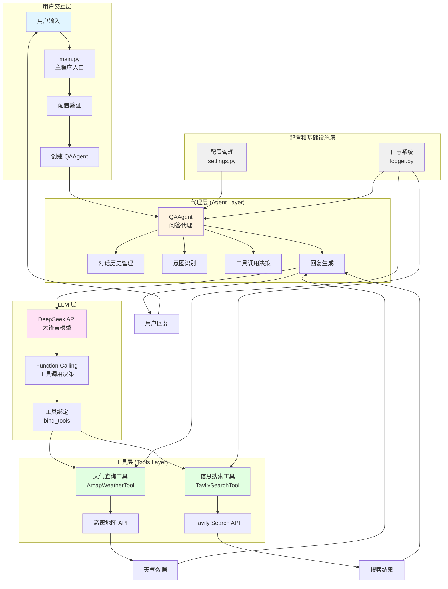
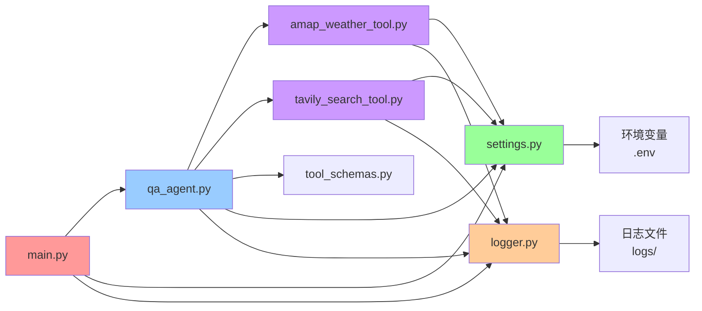
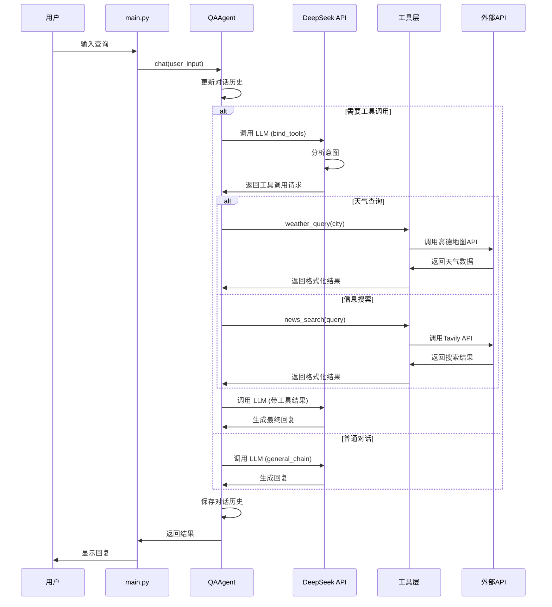
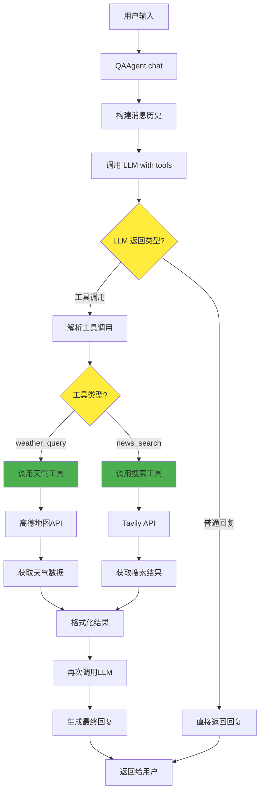
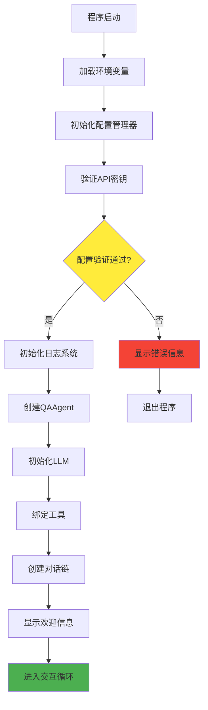
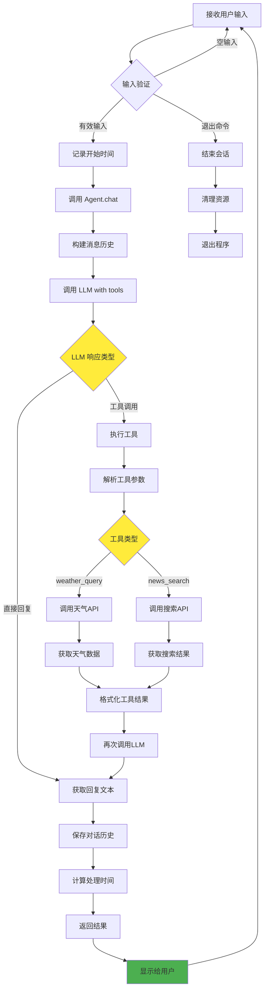
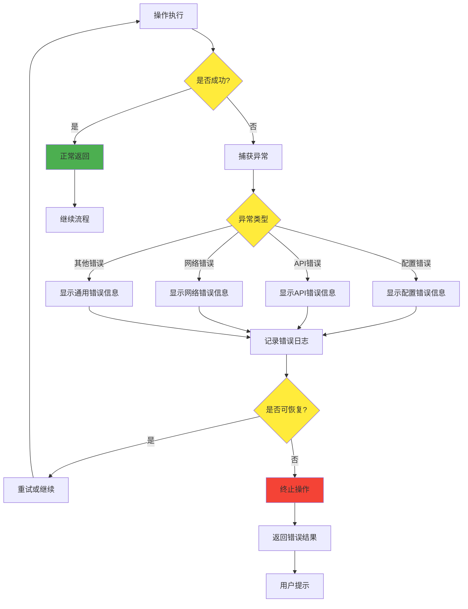
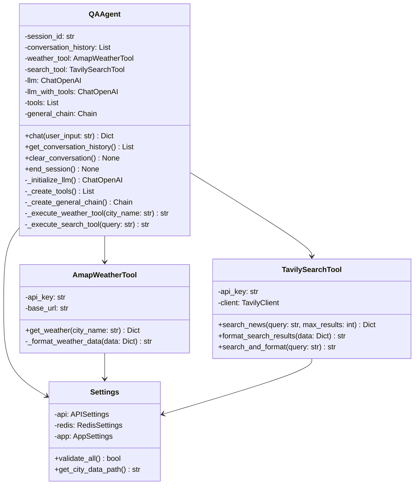
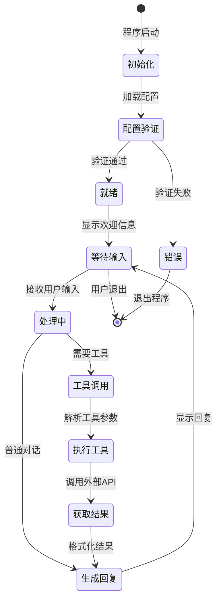
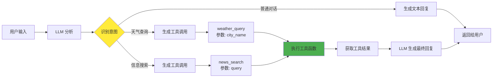

# 项目架构图和流程图

本文档包含项目的系统架构图、数据流程图和关键业务流程。

## 📐 系统架构图

### 整体架构

### 模块依赖关系

## 🔄 数据流程图

### 用户查询处理流程

### 工具调用决策流程

## 🔀 关键业务流程

### 1. 系统初始化流程

### 2. 对话处理流程

### 3. 错误处理流程

## 🏛️ 类图

### QAAgent 类结构

## 📊 状态图

### 对话状态转换

## 🔧 工具调用机制

### Function Calling 流程

## 📝 说明

### 架构设计原则

1. **分层架构**: 清晰的层次划分，便于维护和扩展
2. **单一职责**: 每个模块只负责一个功能
3. **依赖注入**: 通过配置管理统一管理依赖
4. **错误处理**: 完善的异常处理和日志记录

### 关键设计模式

1. **代理模式**: QAAgent 作为用户和工具之间的代理
2. **策略模式**: 不同工具使用不同的执行策略
3. **单例模式**: Settings 使用单例模式确保配置一致性
4. **链式调用**: 使用 LangChain LCEL 构建对话链

### 扩展点

1. **新工具添加**: 在 `tools/` 目录添加新工具类
2. **LLM 切换**: 修改 `settings.py` 中的 API 配置
3. **缓存集成**: 在工具层添加缓存逻辑
4. **持久化**: 在 Agent 层添加数据库存储

---

**注意**: 所有图表使用 Mermaid 语法，可以在支持 Mermaid 的 Markdown 查看器中查看（如 GitHub、GitLab、VS Code 等）。
