# AutoGen 多智能体客服系统 - 架构图和流程图

本文档包含系统的架构图、流程图和交互图，帮助理解系统的整体设计和运行流程。

---

## 1. 系统架构图

### 1.1 整体架构

```mermaid
graph TB
    subgraph "用户层"
        User[用户/客户]
    end

    subgraph "应用层"
        Main[main.py<br/>主入口]
        CLI[Rich CLI<br/>命令行界面]
    end

    subgraph "智能体层 (AutoGen)"
        UserProxy[用户代理<br/>UserProxyAgent]
        CustomerService[客服接待员<br/>Customer Service Agent]
        OrderQuery[订单查询专员<br/>Order Query Agent]
        Logistics[物流跟踪专员<br/>Logistics Agent]
        Summary[客服主管<br/>Summary Agent]
        GroupChat[群组聊天<br/>GroupChatManager]
    end

    subgraph "工具层"
        OrderTool[订单查询工具<br/>get_order_info]
        LogisticsTool[物流查询工具<br/>get_logistics_info]
    end

    subgraph "服务层"
        APIClient[API客户端<br/>APIClient]
        Retry[重试机制<br/>Tenacity]
    end

    subgraph "后端服务"
        FastAPI[FastAPI服务器<br/>模拟内部系统]
        OrderAPI[/api/orders/{order_id}]
        LogisticsAPI[/api/logistics/{order_id}]
    end

    subgraph "LLM服务"
        DeepSeek[DeepSeek API<br/>LLM服务]
    end

    subgraph "基础设施"
        Logger[日志系统<br/>Logger]
        Config[配置管理<br/>Settings]
    end

    User -->|查询请求| Main
    Main --> CLI
    Main --> UserProxy
    UserProxy --> GroupChat
    GroupChat --> CustomerService
    GroupChat --> OrderQuery
    GroupChat --> Logistics
    GroupChat --> Summary

    OrderQuery --> OrderTool
    Logistics --> LogisticsTool

    OrderTool --> APIClient
    LogisticsTool --> APIClient
    APIClient --> Retry
    Retry --> FastAPI
    FastAPI --> OrderAPI
    FastAPI --> LogisticsAPI

    CustomerService --> DeepSeek
    OrderQuery --> DeepSeek
    Logistics --> DeepSeek
    Summary --> DeepSeek

    Main --> Logger
    Main --> Config
    APIClient --> Logger
    FastAPI --> Logger
```

### 1.2 模块依赖关系

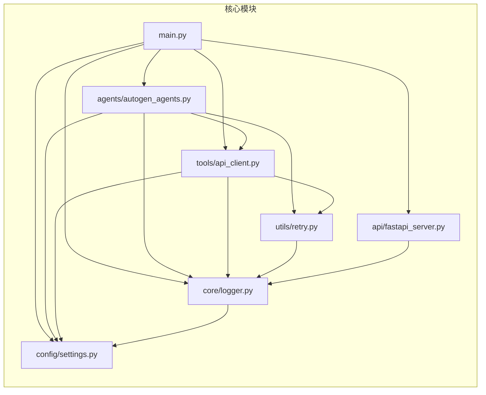

---

## 2. 数据流图

### 2.1 订单查询数据流

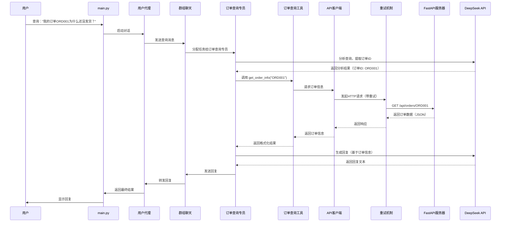

### 2.2 物流查询数据流

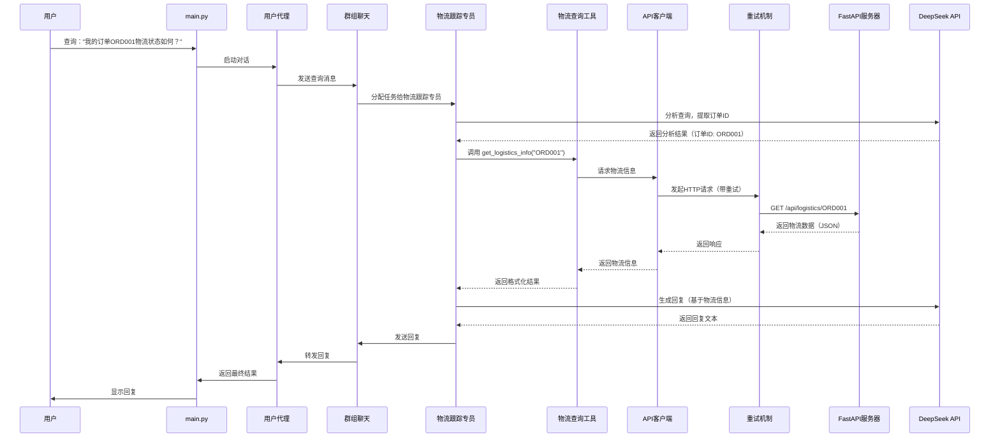

### 2.3 多智能体协作数据流

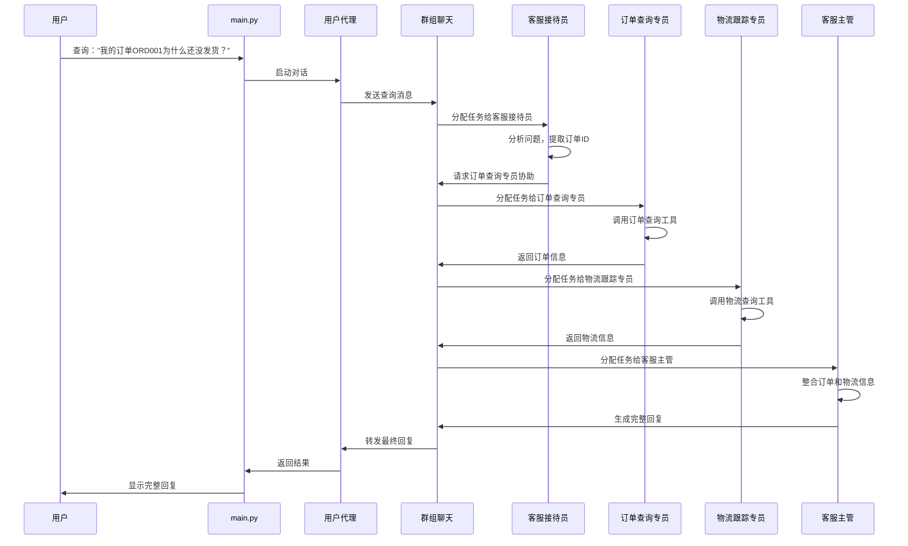

---

## 3. 智能体交互流程图

### 3.1 智能体协作流程

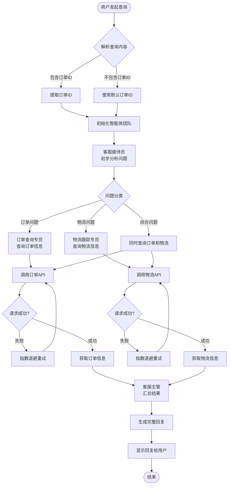

### 3.2 重试机制流程图

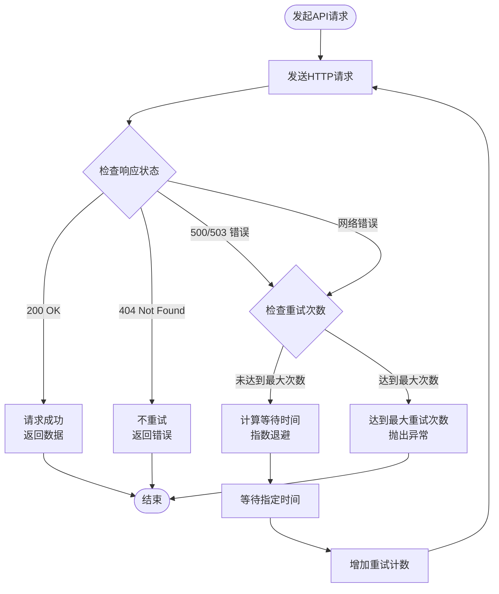

---

## 4. 类图

### 4.1 核心类关系

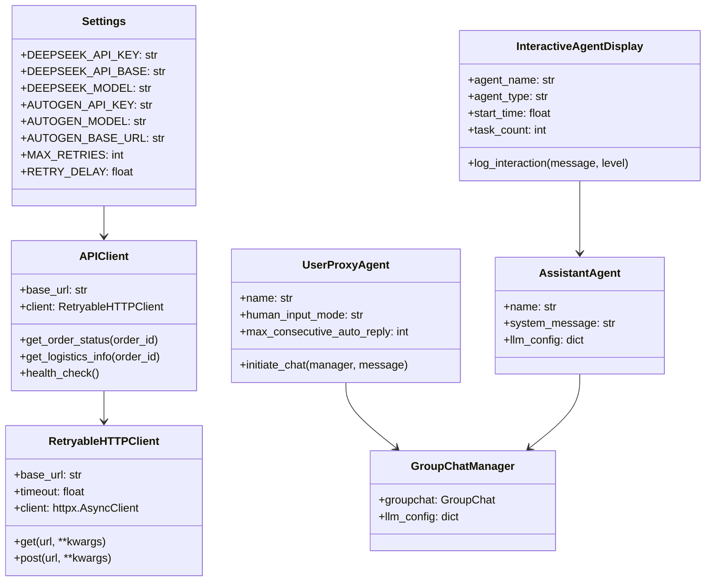

---

## 5. 状态图

### 5.1 智能体状态转换

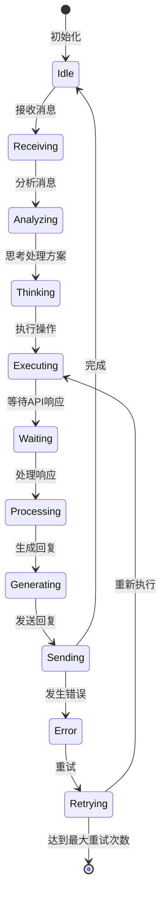

### 5.2 API请求状态转换

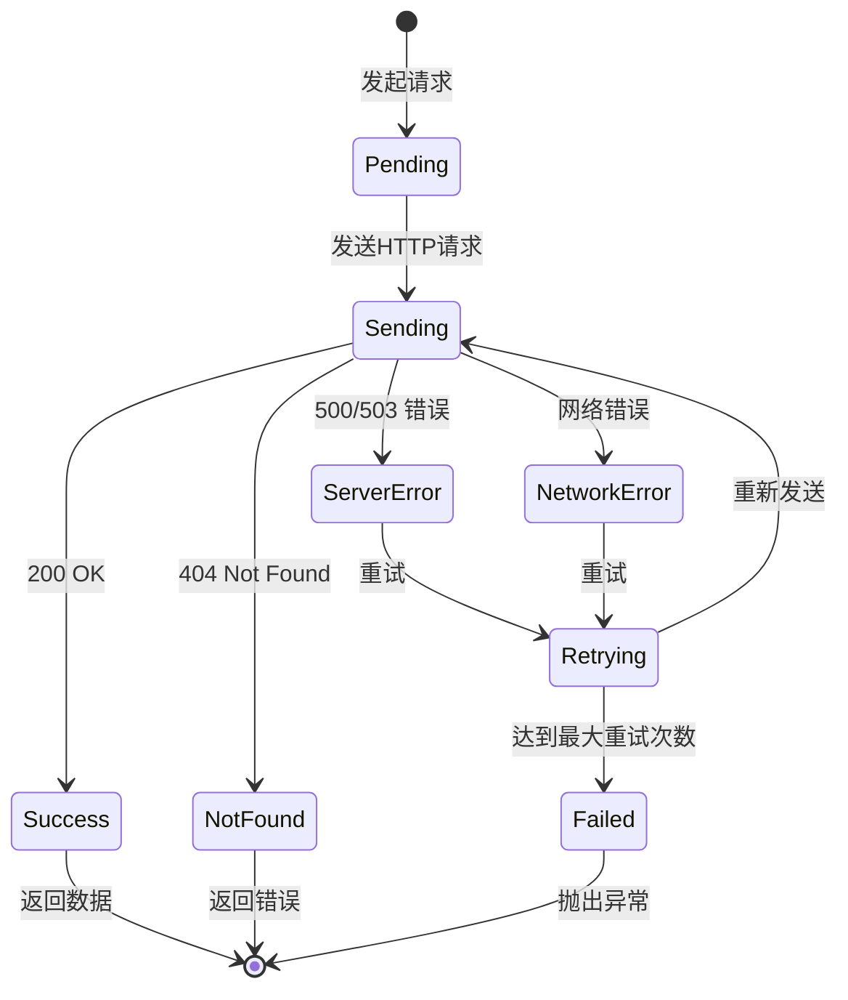

---

## 6. 部署架构图

### 6.1 系统部署架构

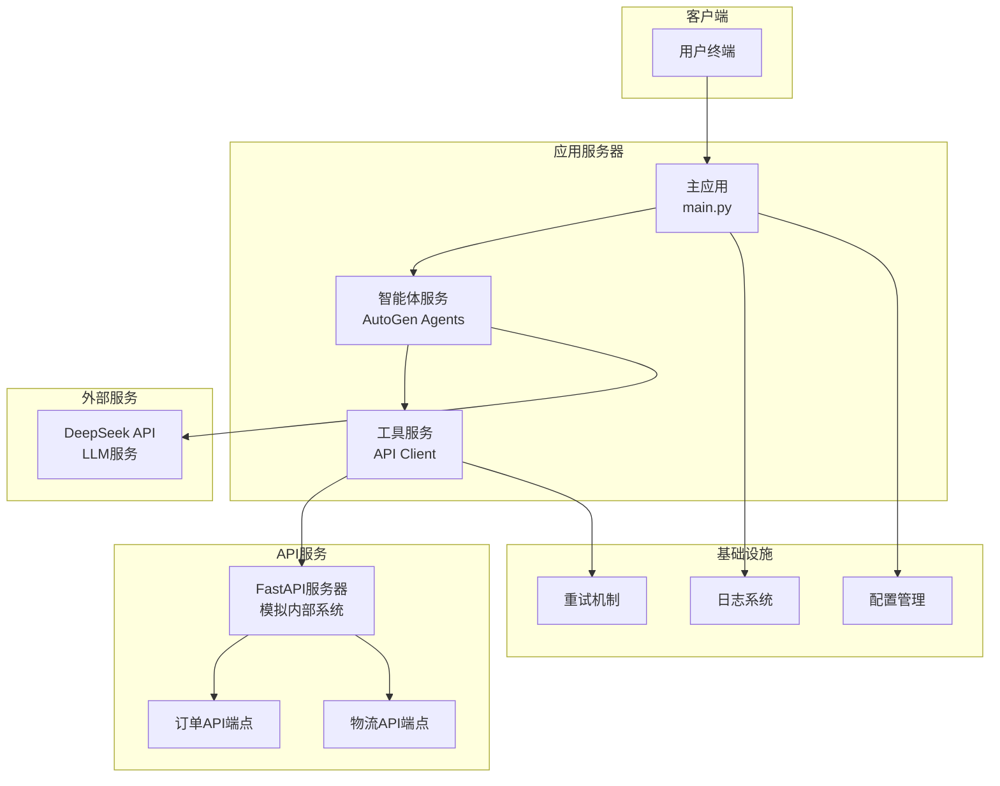

---

## 7. 错误处理流程图

### 7.1 错误处理流程

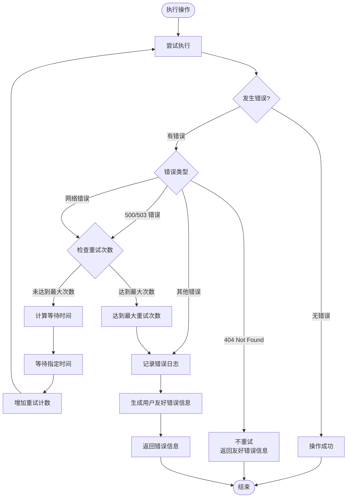

---

## 8. 配置管理流程图

### 8.1 配置加载流程

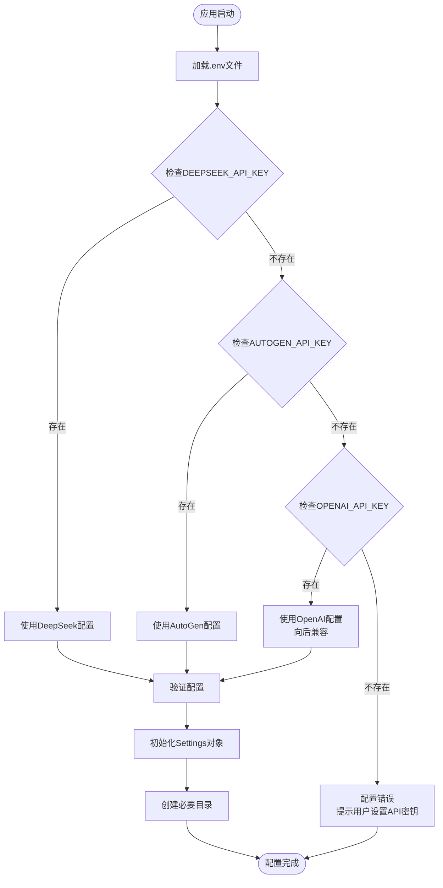

---

## 9. 日志记录流程图

### 9.1 日志记录流程

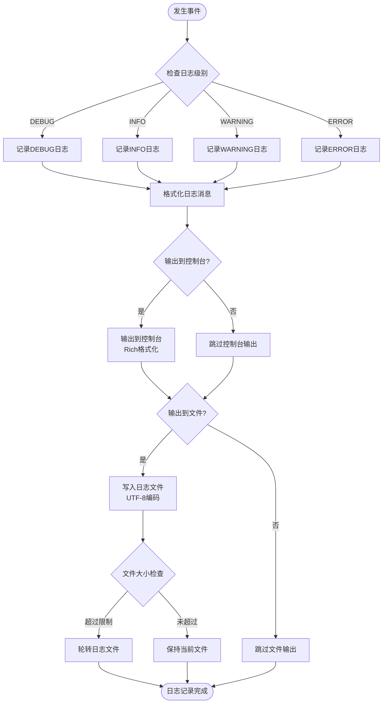

---

## 10. 总结

本文档展示了 AutoGen 多智能体客服系统的完整架构和流程：

1. **系统架构**：展示了从用户层到基础设施层的完整架构
2. **数据流**：展示了订单查询、物流查询和多智能体协作的数据流
3. **智能体交互**：展示了智能体之间的协作流程
4. **重试机制**：展示了指数退避重试的详细流程
5. **类图**：展示了核心类之间的关系
6. **状态图**：展示了智能体和API请求的状态转换
7. **部署架构**：展示了系统的部署结构
8. **错误处理**：展示了错误处理的完整流程
9. **配置管理**：展示了配置加载的流程
10. **日志记录**：展示了日志记录的流程

这些图表帮助理解系统的设计思路和运行机制，便于后续的开发和维护。

---

**文档版本**: v1.0
**最后更新**: 2024年1月
**维护者**: AutoGen 多智能体客服系统开发团队
