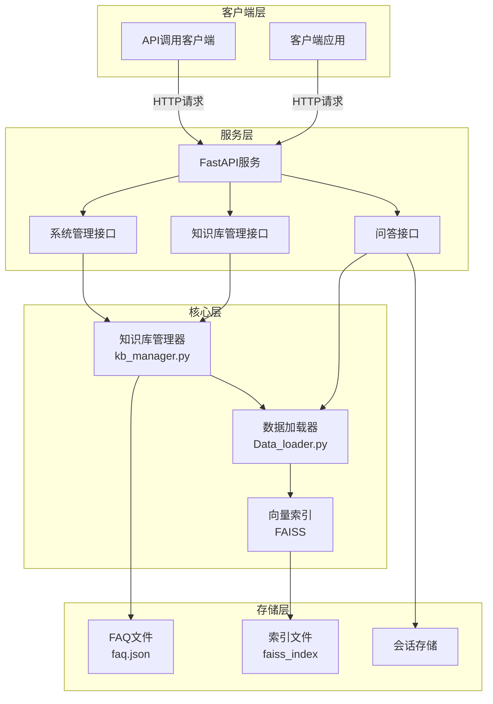

# FAQ知识库管理系统架构图

## 系统架构

## 架构说明

### 客户端层
- **客户端应用**：用户直接交互的应用程序，通过HTTP请求访问系统功能
- **API调用客户端**：第三方系统通过API接口调用系统功能

### 服务层
- **FastAPI服务**：提供RESTful API接口，处理HTTP请求和响应
- **问答接口**：处理用户的问题查询，返回相关答案
- **知识库管理接口**：管理FAQ条目的增删改查操作
- **系统管理接口**：提供系统健康检查、索引重建等管理功能

### 核心层
- **知识库管理器**：管理FAQ条目，包括增删改查、批量导入导出、版本管理等功能
- **数据加载器**：解析FAQ文件，创建文档对象，构建和管理向量索引
- **向量索引**：使用FAISS存储和查询向量数据，实现高效的相似度检索

### 存储层
- **FAQ文件**：存储FAQ条目的JSON文件
- **索引文件**：存储向量索引的FAISS文件
- **会话存储**：存储用户会话历史（内存存储，生产环境建议使用Redis）

## 技术栈
- **后端框架**：FastAPI
- **向量数据库**：FAISS
- **文档处理**：LlamaIndex
- **模型**：BGE-M3（用于文本向量化）
- **存储**：文件系统（JSON文件）
- **API标准**：RESTful API

## 核心流程
1. **初始化流程**：加载配置 → 解析FAQ文件 → 构建向量索引 → 启动API服务
2. **查询流程**：接收用户问题 → 向量化处理 → 向量相似度检索 → 生成答案 → 返回结果
3. **知识库管理流程**：接收管理请求 → 操作FAQ文件 → 重建向量索引 → 返回操作结果