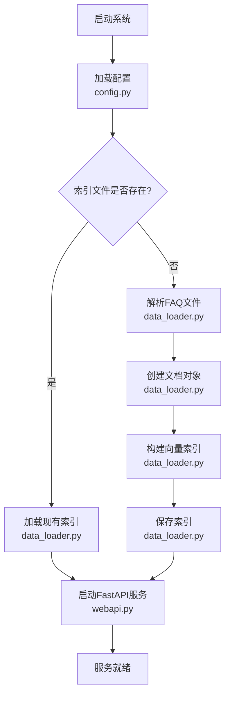
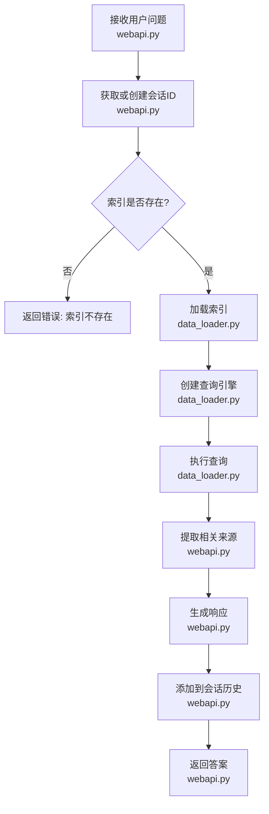
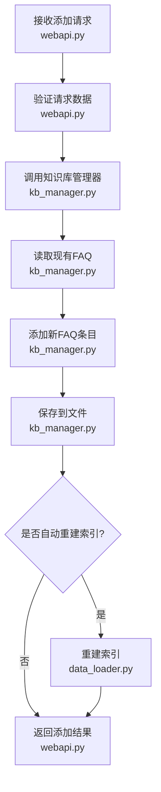
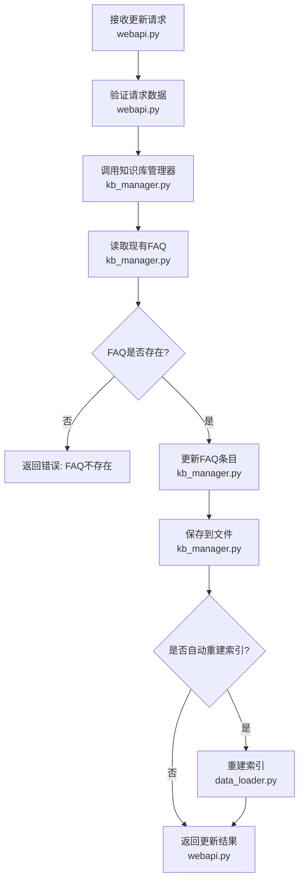
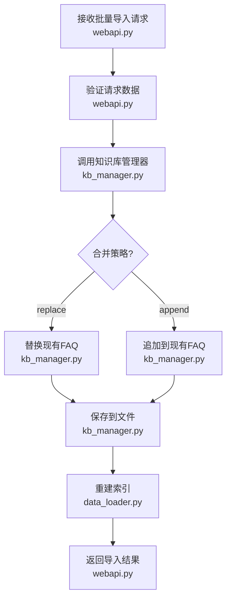
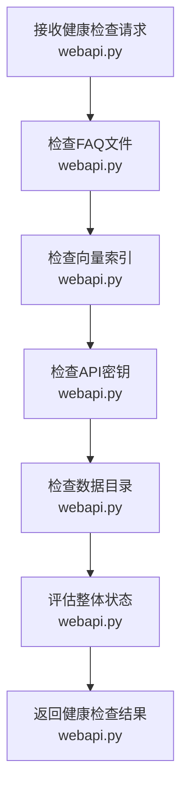
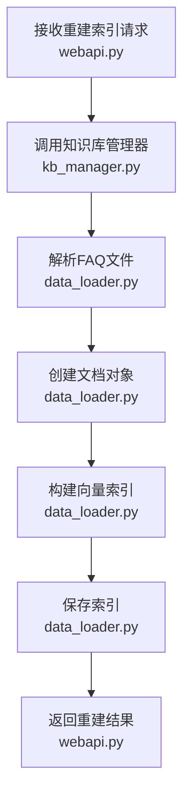

# FAQ知识库管理系统流程图

## 1. 系统初始化流程

```mermaid
flowchart TD
    A[启动系统] --> B[加载配置\nconfig.py]
    B --> C{索引文件是否存在?}
    C -->|是| D[加载现有索引\ndata_loader.py]
    C -->|否| E[解析FAQ文件\ndata_loader.py]
    E --> F[创建文档对象\ndata_loader.py]
    F --> G[构建向量索引\ndata_loader.py]
    G --> H[保存索引\ndata_loader.py]
    D --> I[启动FastAPI服务\nwebapi.py]
    H --> I
    I --> J[服务就绪]
```

## 2. 问答查询流程

```mermaid
flowchart TD
    A[接收用户问题\nwebapi.py] --> B[获取或创建会话ID\nwebapi.py]
    B --> C{索引是否存在?}
    C -->|否| D[返回错误: 索引不存在]
    C -->|是| E[加载索引\ndata_loader.py]
    E --> F[创建查询引擎\ndata_loader.py]
    F --> G[执行查询\ndata_loader.py]
    G --> H[提取相关来源\nwebapi.py]
    H --> I[生成响应\nwebapi.py]
    I --> J[添加到会话历史\nwebapi.py]
    J --> K[返回答案\nwebapi.py]
```

## 3. 知识库管理流程

### 3.1 添加FAQ条目

```mermaid
flowchart TD
    A[接收添加请求\nwebapi.py] --> B[验证请求数据\nwebapi.py]
    B --> C[调用知识库管理器\nkb_manager.py]
    C --> D[读取现有FAQ\nkb_manager.py]
    D --> E[添加新FAQ条目\nkb_manager.py]
    E --> F[保存到文件\nkb_manager.py]
    F --> G{是否自动重建索引?}
    G -->|是| H[重建索引\ndata_loader.py]
    G -->|否| I[返回添加结果\nwebapi.py]
    H --> I
```

### 3.2 更新FAQ条目

```mermaid
flowchart TD
    A[接收更新请求\nwebapi.py] --> B[验证请求数据\nwebapi.py]
    B --> C[调用知识库管理器\nkb_manager.py]
    C --> D[读取现有FAQ\nkb_manager.py]
    D --> E{FAQ是否存在?}
    E -->|否| F[返回错误: FAQ不存在]
    E -->|是| G[更新FAQ条目\nkb_manager.py]
    G --> H[保存到文件\nkb_manager.py]
    H --> I{是否自动重建索引?}
    I -->|是| J[重建索引\ndata_loader.py]
    I -->|否| K[返回更新结果\nwebapi.py]
    J --> K
```

### 3.3 删除FAQ条目

```mermaid
flowchart TD
    A[接收删除请求\nwebapi.py] --> B[验证请求数据\nwebapi.py]
    B --> C[调用知识库管理器\nkb_manager.py]
    C --> D[读取现有FAQ\nkb_manager.py]
    D --> E{FAQ是否存在?}
    E -->|否| F[返回错误: FAQ不存在]
    E -->|是| G[删除FAQ条目\nkb_manager.py]
    G --> H[保存到文件\nkb_manager.py]
    H --> I{是否自动重建索引?}
    I -->|是| J[重建索引\ndata_loader.py]
    I -->|否| K[返回删除结果\nwebapi.py]
    J --> K
```

### 3.4 批量导入FAQ

```mermaid
flowchart TD
    A[接收批量导入请求\nwebapi.py] --> B[验证请求数据\nwebapi.py]
    B --> C[调用知识库管理器\nkb_manager.py]
    C --> D{合并策略?}
    D -->|replace| E[替换现有FAQ\nkb_manager.py]
    D -->|append| F[追加到现有FAQ\nkb_manager.py]
    E --> G[保存到文件\nkb_manager.py]
    F --> G
    G --> H[重建索引\ndata_loader.py]
    H --> I[返回导入结果\nwebapi.py]
```

## 4. 系统管理流程

### 4.1 健康检查

```mermaid
flowchart TD
    A[接收健康检查请求\nwebapi.py] --> B[检查FAQ文件\nwebapi.py]
    B --> C[检查向量索引\nwebapi.py]
    C --> D[检查API密钥\nwebapi.py]
    D --> E[检查数据目录\nwebapi.py]
    E --> F[评估整体状态\nwebapi.py]
    F --> G[返回健康检查结果\nwebapi.py]
```

### 4.2 重建索引

```mermaid
flowchart TD
    A[接收重建索引请求\nwebapi.py] --> B[调用知识库管理器\nkb_manager.py]
    B --> C[解析FAQ文件\ndata_loader.py]
    C --> D[创建文档对象\ndata_loader.py]
    D --> E[构建向量索引\ndata_loader.py]
    E --> F[保存索引\ndata_loader.py]
    F --> G[返回重建结果\nwebapi.py]
```