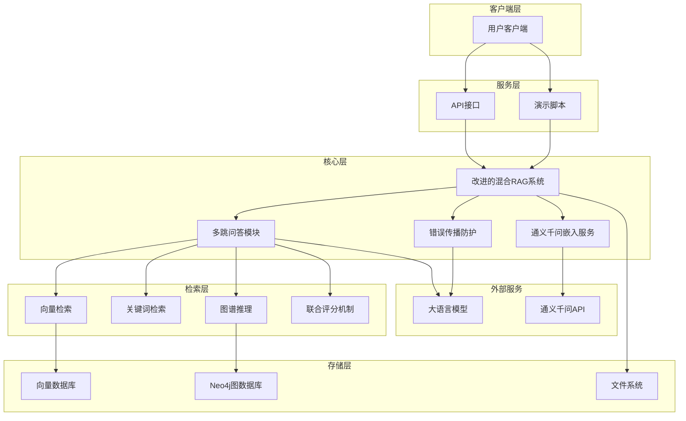

# 混合RAG系统架构图

## 系统架构概述

本系统是一个融合向量检索、关键词检索和图谱推理的混合RAG（Retrieval-Augmented Generation）系统，用于实现多跳问答功能。系统架构分为客户端层、服务层、核心层和存储层四个主要部分。

## 架构组件说明

### 1. 客户端层
- **用户客户端**：用户与系统交互的界面，发送查询请求并接收回答
- **演示脚本**：用于展示系统功能的测试脚本，验证系统各模块的工作状态

### 2. 服务层
- **API接口**：提供系统的对外接口，处理用户请求
- **演示脚本**：用于测试和验证系统功能的脚本

### 3. 核心层
- **改进的混合RAG系统**：系统的核心类，整合各模块功能
- **通义千问嵌入服务**：提供文本向量化功能，支持中文理解
- **多跳问答模块**：实现多跳推理和问答功能
- **错误传播防护**：检测并防止错误信息的传播，提高系统可靠性

### 4. 检索层
- **向量检索**：基于文本嵌入的相似度搜索
- **关键词检索**：基于jieba分词的关键词匹配
- **图谱推理**：基于Neo4j图数据库的多跳关系推理
- **联合评分机制**：结合三个检索模块的结果，计算综合得分

### 5. 存储层
- **向量数据库**：存储文档及其嵌入向量
- **Neo4j图数据库**：存储实体关系和知识图谱
- **文件系统**：存储原始文本数据

### 6. 外部服务
- **通义千问API**：提供文本嵌入和大语言模型服务
- **大语言模型**：用于实体提取、关系提取和答案生成

## 数据流说明

1. **用户查询**：用户通过客户端发送查询请求
2. **实体提取**：系统从查询中提取相关实体
3. **多源检索**：并行执行向量检索、关键词检索和图谱推理
4. **联合评分**：结合三个检索模块的结果，计算综合得分
5. **错误防护**：检测并过滤低质量结果，防止错误传播
6. **答案生成**：基于过滤后的结果生成最终答案
7. **结果返回**：将答案返回给用户

## 系统特点

1. **多源检索**：融合向量、关键词和图谱三种检索方式，提高检索准确性
2. **多跳推理**：支持多跳关系查询，解决复杂问题
3. **错误防护**：通过置信度检测和过滤机制，防止错误信息传播
4. **中文优化**：使用通义千问和jieba分词，优化中文理解和处理
5. **模块化设计**：各模块职责清晰，易于维护和扩展
