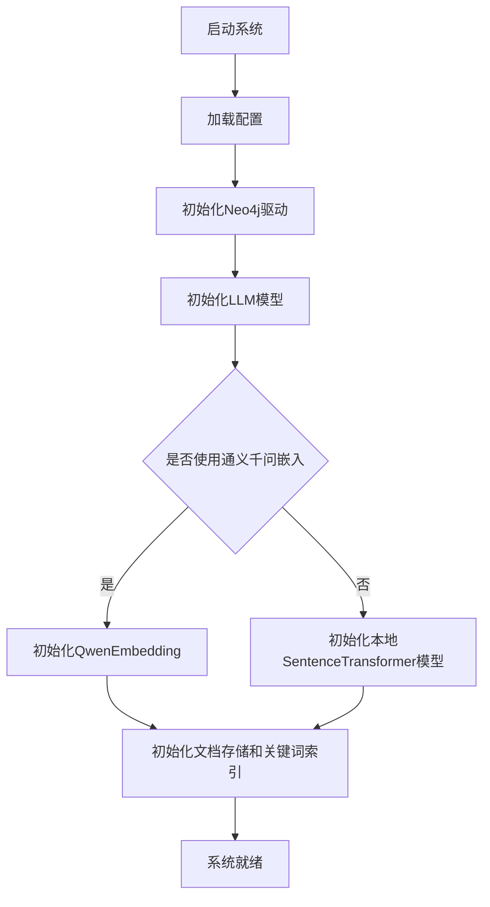
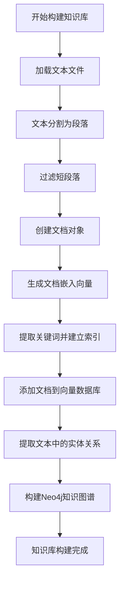
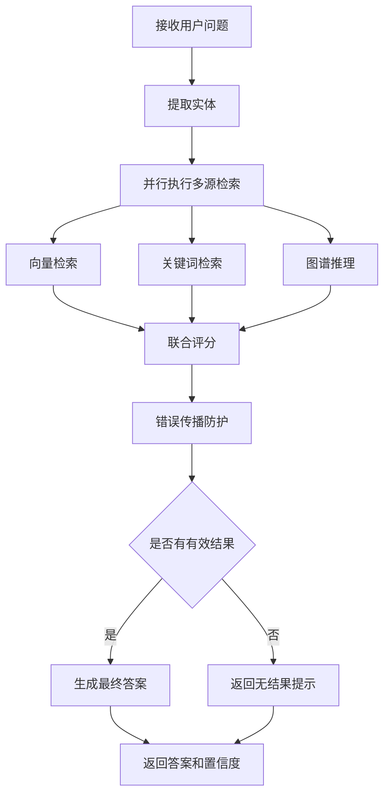
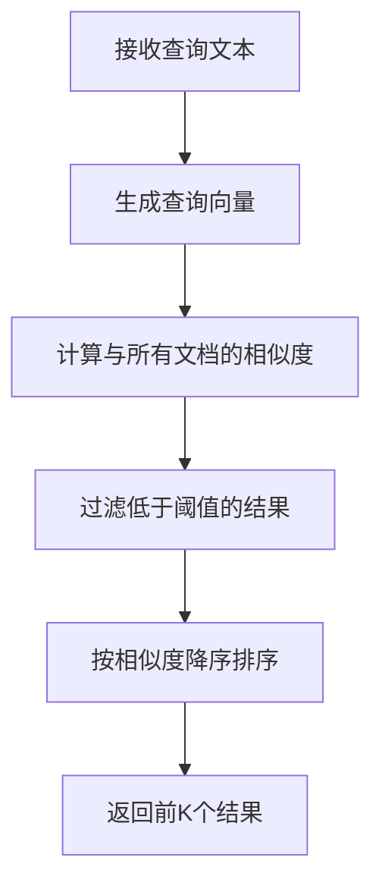
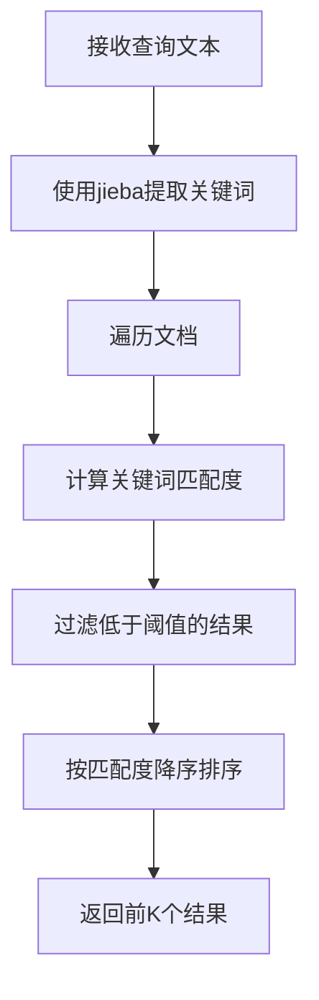
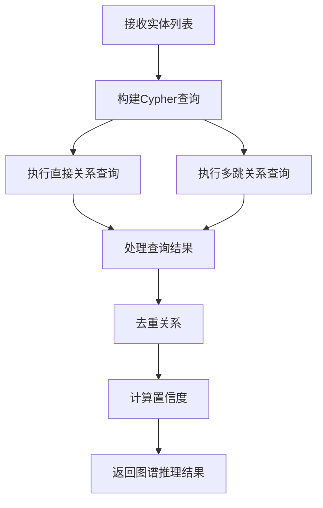
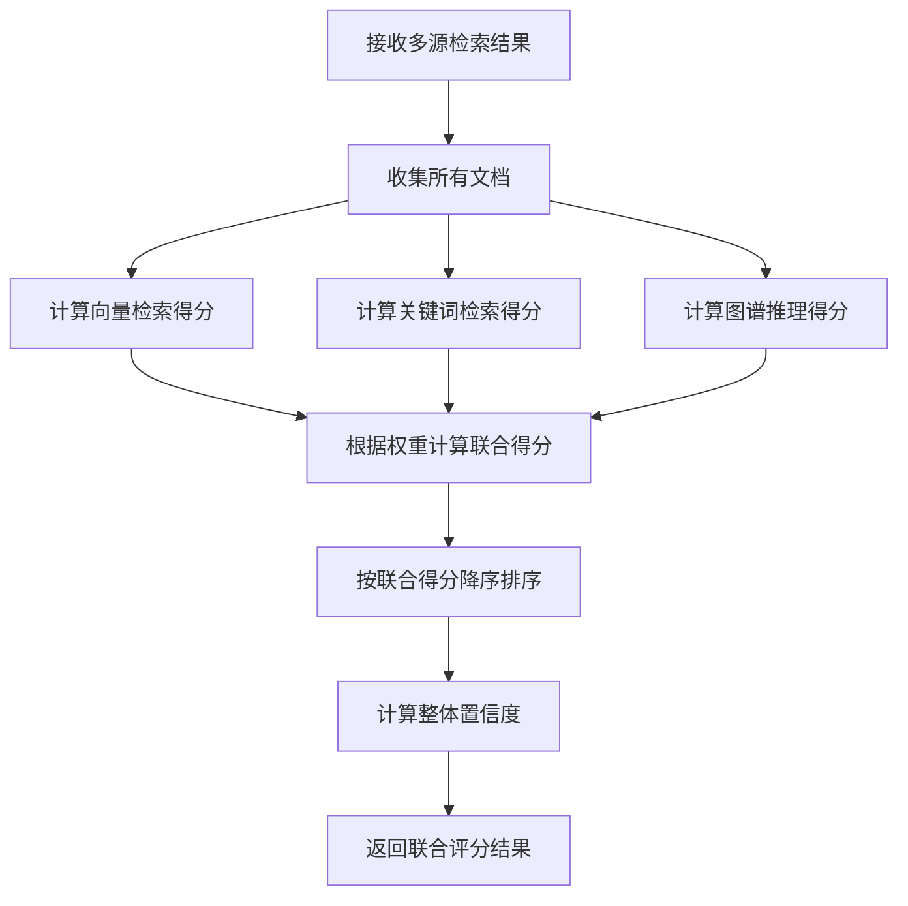
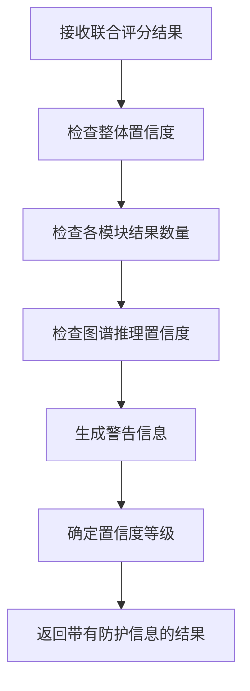
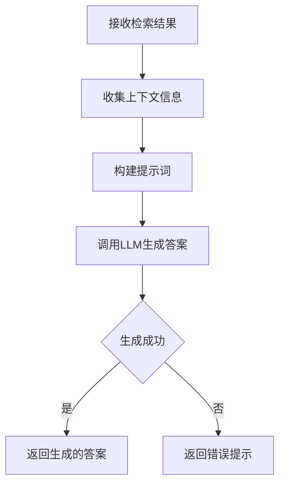

# 混合RAG系统流程图

## 1. 系统初始化流程

```mermaid
flowchart TD
    A[启动系统] --> B[加载配置]
    B --> C[初始化Neo4j驱动]
    C --> D[初始化LLM模型]
    D --> E{是否使用通义千问嵌入}
    E -->|是| F[初始化QwenEmbedding]
    E -->|否| G[初始化本地SentenceTransformer模型]
    F --> H[初始化文档存储和关键词索引]
    G --> H
    H --> I[系统就绪]
```

## 2. 知识库构建流程

```mermaid
flowchart TD
    A[开始构建知识库] --> B[加载文本文件]
    B --> C[文本分割为段落]
    C --> D[过滤短段落]
    D --> E[创建文档对象]
    E --> F[生成文档嵌入向量]
    F --> G[提取关键词并建立索引]
    G --> H[添加文档到向量数据库]
    H --> I[提取文本中的实体关系]
    I --> J[构建Neo4j知识图谱]
    J --> K[知识库构建完成]
```

## 3. 多跳问答流程

```mermaid
flowchart TD
    A[接收用户问题] --> B[提取实体]
    B --> C[并行执行多源检索]
    C --> D1[向量检索]
    C --> D2[关键词检索]
    C --> D3[图谱推理]
    D1 --> E[联合评分]
    D2 --> E
    D3 --> E
    E --> F[错误传播防护]
    F --> G{是否有有效结果}
    G -->|是| H[生成最终答案]
    G -->|否| I[返回无结果提示]
    H --> J[返回答案和置信度]
    I --> J
```

## 4. 向量检索流程

```mermaid
flowchart TD
    A[接收查询文本] --> B[生成查询向量]
    B --> C[计算与所有文档的相似度]
    C --> D[过滤低于阈值的结果]
    D --> E[按相似度降序排序]
    E --> F[返回前K个结果]
```

## 5. 关键词检索流程

```mermaid
flowchart TD
    A[接收查询文本] --> B[使用jieba提取关键词]
    B --> C[遍历文档]
    C --> D[计算关键词匹配度]
    D --> E[过滤低于阈值的结果]
    E --> F[按匹配度降序排序]
    F --> G[返回前K个结果]
```

## 6. 图谱推理流程

```mermaid
flowchart TD
    A[接收实体列表] --> B[构建Cypher查询]
    B --> C[执行直接关系查询]
    B --> D[执行多跳关系查询]
    C --> E[处理查询结果]
    D --> E
    E --> F[去重关系]
    F --> G[计算置信度]
    G --> H[返回图谱推理结果]
```

## 7. 联合评分流程

```mermaid
flowchart TD
    A[接收多源检索结果] --> B[收集所有文档]
    B --> C[计算向量检索得分]
    B --> D[计算关键词检索得分]
    B --> E[计算图谱推理得分]
    C --> F[根据权重计算联合得分]
    D --> F
    E --> F
    F --> G[按联合得分降序排序]
    G --> H[计算整体置信度]
    H --> I[返回联合评分结果]
```

## 8. 错误传播防护流程

```mermaid
flowchart TD
    A[接收联合评分结果] --> B[检查整体置信度]
    B --> C[检查各模块结果数量]
    C --> D[检查图谱推理置信度]
    D --> E[生成警告信息]
    E --> F[确定置信度等级]
    F --> G[返回带有防护信息的结果]
```

## 9. 答案生成流程

```mermaid
flowchart TD
    A[接收检索结果] --> B[收集上下文信息]
    B --> C[构建提示词]
    C --> D[调用LLM生成答案]
    D --> E{生成成功}
    E -->|是| F[返回生成的答案]
    E -->|否| G[返回错误提示]
```
