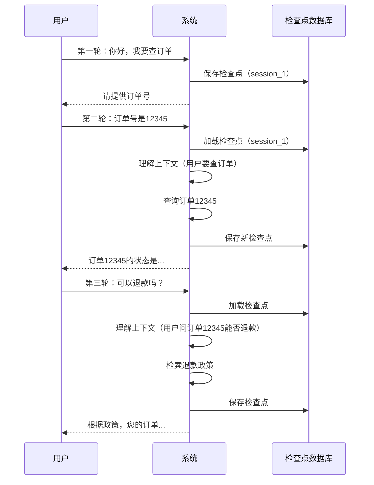
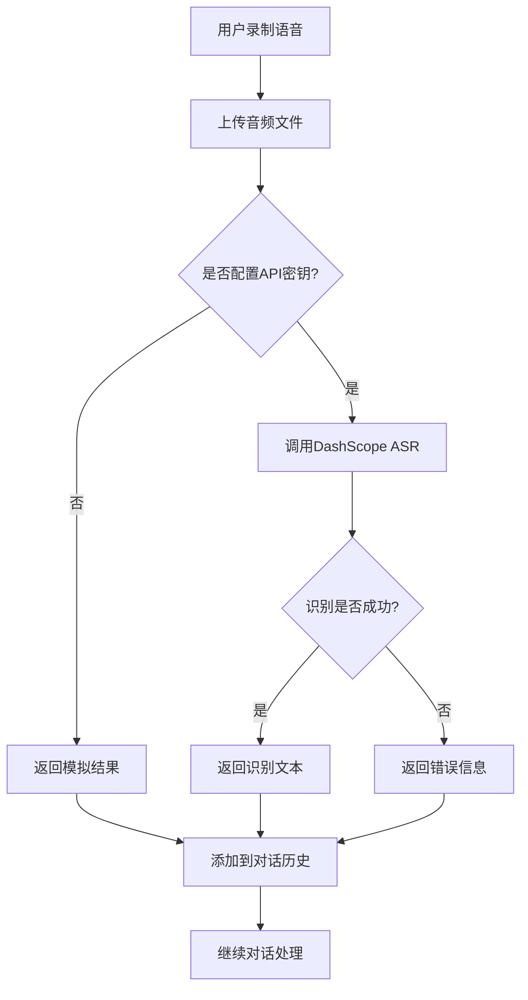
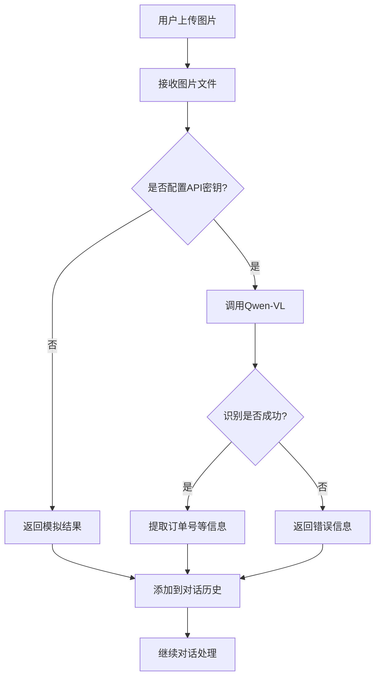
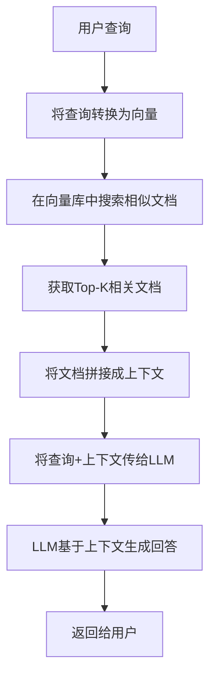

# 技术详细介绍

本项目使用了多种先进的 AI 技术和工具，下面将详细介绍多轮对话、对话记录持久化、语言输入、图像上传、RAG 和 SQLite 等核心技术。

---

## 一、多轮对话 (Multi-turn Dialogue)

### 1.1 什么是多轮对话？

多轮对话是指用户与系统之间进行的连续交互，系统能够理解上下文并基于之前的对话内容进行回应。与单轮对话不同，多轮对话具有以下特点：

- **上下文记忆**：系统能够记住之前的对话内容
- **意图延续**：用户的问题可能是上一轮对话的延续
- **指代消解**：能够理解"它"、"这个"等指代词语
- **话题转换**：支持用户在对话中切换话题

### 1.2 本项目中的多轮对话实现

**核心文件位置**：`demo.py` 第 331-351 行（AgentState 定义）、第 576-585 行（检查点配置）

#### 实现原理

```python
# 1. 定义状态结构
class AgentState(TypedDict):
    messages: Annotated[List[BaseMessage], operator.add]
    order_id: Optional[str]

# 2. 配置检查点持久化
conn = sqlite3.connect("checkpoints.db", check_same_thread=False)
memory = SqliteSaver(conn)

# 3. 编译工作流时启用检查点
app = workflow.compile(checkpointer=memory)

# 4. 使用 thread_id 隔离对话
config = {"configurable": {"thread_id": "session_1"}}
```

#### 技术要点

1. **状态管理**：使用 `AgentState` 存储对话状态，包括消息列表和订单号
2. **消息追加**：使用 `Annotated[List[BaseMessage], operator.add]` 实现消息的自动追加
3. **检查点持久化**：使用 `SqliteSaver` 将对话状态保存到 SQLite 数据库
4. **会话隔离**：使用 `thread_id` 区分不同的对话会话

### 1.3 多轮对话的工作流程



### 1.4 多轮对话的关键技术

1. **对话历史管理**
   - 存储所有历史消息（用户消息、AI 消息、工具消息）
   - 消息类型：HumanMessage、AIMessage、ToolMessage、SystemMessage
   - 每次新消息都追加到历史列表中

2. **上下文理解**
   - LLM 接收完整的对话历史作为输入
   - LLM 能够根据上下文理解用户的意图
   - 支持指代消解、话题延续等

3. **会话隔离**
   - 使用 `thread_id` 区分不同的对话会话
   - 不同用户的对话相互隔离
   - 同一用户的多次对话使用相同的 `thread_id`

---

## 二、对话记录持久化 (Dialogue Persistence)

### 2.1 什么是对话记录持久化？

对话记录持久化是指将对话状态保存到持久化存储（如数据库）中，以便在系统重启或对话中断后能够恢复对话。

### 2.2 本项目中的对话记录持久化实现

**核心文件位置**：`demo.py` 第 576-585 行

#### 实现代码

```python
# 配置检查点持久化
# 使用 SqliteSaver 将对话状态保存到 SQLite 数据库
# 这样可以实现对话中断后恢复和多轮对话上下文管理
conn = sqlite3.connect("checkpoints.db", check_same_thread=False)
memory = SqliteSaver(conn)

# 编译工作流
# 将工作流编译为可执行的应用
# checkpointer=memory 表示使用 SqliteSaver 作为检查点持久化
app = workflow.compile(checkpointer=memory)
```

### 2.3 LangGraph Checkpoint 机制

LangGraph 的检查点机制是实现对话持久化的核心，它的工作原理如下：

#### 检查点数据结构

```python
# 检查点包含以下信息：
{
    "thread_id": "session_1",           # 会话ID
    "checkpoint_id": "uuid-xxx",          # 检查点ID
    "parent_checkpoint_id": "uuid-yyy",    # 父检查点ID
    "checkpoint": {                        # 检查点内容
        "messages": [...],                # 对话历史
        "order_id": "12345"               # 其他状态
    },
    "metadata": {                          # 元数据
        "step": 3,                        # 步骤数
        "timestamp": "2024-01-01T00:00:00"
    }
}
```

#### 检查点的工作流程

1. **保存检查点**
   - 每次工作流执行后自动保存检查点
   - 保存当前的完整状态（消息列表、所有状态字段）
   - 生成唯一的检查点 ID

2. **加载检查点**
   - 根据 `thread_id` 查找最新的检查点
   - 恢复之前的状态
   - 从检查点继续执行

3. **检查点版本管理**
   - 支持多个检查点版本
   - 可以回滚到之前的检查点
   - 支持对话历史回放

### 2.4 对话持久化的优势

1. **对话恢复**
   - 系统重启后可以恢复之前的对话
   - 用户刷新页面后可以继续对话
   - 支持长时间运行的对话

2. **对话历史**
   - 可以查看历史对话记录
   - 支持对话数据分析
   - 可以用于训练和优化

3. **并发支持**
   - 多个用户可以同时对话
   - 使用 `thread_id` 隔离不同会话
   - 支持高并发场景

4. **调试和监控**
   - 可以查看每个检查点的状态
   - 便于调试和问题定位
   - 支持性能监控

---

## 三、语音输入 (ASR - Automatic Speech Recognition)

### 3.1 什么是语音输入？

语音输入是指将用户的语音转换为文本的技术，也称为自动语音识别（ASR）。

### 3.2 本项目中的语音输入实现

**核心文件位置**：`demo.py` 第 244-283 行

#### 实现代码

```python
def process_audio_input(file_path: str) -> str:
    """
    使用 Qwen/Dashscope 进行语音转写（演示中为模拟）。

    ASR (Automatic Speech Recognition) 是自动语音识别技术
    """
    print(f"[系统] 正在处理音频文件：{file_path}")

    # 从环境变量获取 API 密钥
    api_key = os.getenv("DASHSCOPE_API_KEY")

    if not api_key:
        # 如果没有检测到 API Key，返回模拟 ASR 结果用于演示
        print("[系统] 未检测到 API Key，返回模拟 ASR 结果。")
        return "查订单 12345" # 模拟结果

    try:
        # 真实实现：使用 DashScope ASR
        # task = dashscope.audio.asr.Recognition.call(...)
        # 演示保持为模拟，返回固定文本。
        return "查订单 12345"
    except Exception as e:
        # 捕获异常并返回错误信息
        return f"Error in ASR: {str(e)}"
```

### 3.3 阿里云 DashScope ASR 服务

阿里云 DashScope 提供了强大的语音识别服务，支持多种语言和场景。

#### 真实实现示例

```python
import dashscope
from dashscope.audio.asr import Recognition

def real_asr_process(file_path: str) -> str:
    """真实的 ASR 处理函数"""

    # 设置 API 密钥
    dashscope.api_key = os.getenv("DASHSCOPE_API_KEY")

    # 调用语音识别服务
    result = Recognition.call(
        model='paraformer-v2',
        file_path=file_path,
        format='wav'
    )

    # 处理识别结果
    if result.status_code == HTTPStatus.OK:
        return result.output.get('sentence', '')
    else:
        return f"ASR 识别失败：{result.message}"
```

### 3.4 语音输入的工作流程



### 3.5 语音输入的关键技术

1. **音频格式支持**
   - 支持 WAV、MP3 等常见音频格式
   - 支持不同的采样率和比特率
   - 自动音频格式转换

2. **实时语音识别**
   - 支持流式语音识别
   - 实时返回识别结果
   - 支持断点续传

3. **多语言支持**
   - 支持中文、英文等多种语言
   - 自动语言检测
   - 支持方言识别

4. **噪声处理**
   - 自动降噪处理
   - 支持远场识别
   - 提高识别准确率

---

## 四、图像上传 (OCR - Optical Character Recognition)

### 4.1 什么是图像上传？

图像上传是指用户上传图片，系统使用 OCR（光学字符识别）技术从图片中提取文字信息。

### 4.2 本项目中的图像上传实现

**核心文件位置**：`demo.py` 第 285-325 行

#### 实现代码

```python
def process_image_input(file_path: str) -> str:
    """
    使用 Qwen-VL 进行 OCR（演示中为模拟）。

    OCR (Optical Character Recognition) 是光学字符识别技术
    """
    print(f"[系统] 正在处理图片文件：{file_path}")

    # 从环境变量获取 API 密钥
    api_key = os.getenv("DASHSCOPE_API_KEY")

    if not api_key:
        # 如果没有检测到 API Key，返回模拟 OCR 结果用于演示
        print("[系统] 未检测到 API Key，返回模拟 OCR 结果。")
        return "图片中订单号似乎是 67890" # 模拟结果

    try:
        # 真实实现：使用 DashScope 多模态
        # messages = [{...}]
        # response = dashscope.MultiModalConversation.call(model='qwen-vl-max', messages=messages)
        # 演示保持为模拟，返回固定文本。
        return "图片中订单号似乎是 67890"
    except Exception as e:
        # 捕获异常并返回错误信息
        return f"Error in OCR: {str(e)}"
```

### 4.3 阿里云 Qwen-VL 多模态模型

阿里云 Qwen-VL 是一个强大的视觉语言模型，支持图像理解和 OCR。

#### 真实实现示例

```python
import dashscope
from dashscope import MultiModalConversation

def real_ocr_process(file_path: str) -> str:
    """真实的 OCR 处理函数"""

    # 设置 API 密钥
    dashscope.api_key = os.getenv("DASHSCOPE_API_KEY")

    # 构建消息
    messages = [
        {
            "role": "user",
            "content": [
                {"image": f"file://{file_path}"},
                {"text": "请识别图片中的文字，特别是订单号"}
            ]
        }
    ]

    # 调用多模态对话服务
    response = MultiModalConversation.call(
        model='qwen-vl-max',
        messages=messages
    )

    # 处理识别结果
    if response.status_code == HTTPStatus.OK:
        return response.output.choices[0].message.content[0].text
    else:
        return f"OCR 识别失败：{response.message}"
```

### 4.4 图像上传的工作流程



### 4.5 图像上传的关键技术

1. **图像格式支持**
   - 支持 JPG、PNG、BMP 等常见图像格式
   - 支持不同的分辨率
   - 自动图像预处理

2. **OCR 文字识别**
   - 支持印刷体和手写体识别
   - 支持多语言文字识别
   - 支持表格、证件等结构化文档识别

3. **图像理解**
   - 不仅识别文字，还理解图像内容
   - 支持场景理解
   - 支持视觉问答

4. **多模态融合**
   - 结合图像和文本理解
   - 支持图文对话
   - 支持复杂的多模态任务

---

## 五、RAG (Retrieval-Augmented Generation)

### 5.1 什么是 RAG？

RAG（检索增强生成）是一种结合检索和生成的技术，它首先从知识库中检索相关文档，然后将检索到的文档作为上下文，让 LLM 基于这些信息生成回答。

### 5.2 RAG 的优势

1. **减少幻觉**：LLM 基于检索到的真实信息生成回答，减少编造信息
2. **知识更新**：可以通过更新知识库来更新系统的知识，不需要重新训练 LLM
3. **可解释性**：可以追溯回答的来源，查看是基于哪些文档生成的
4. **隐私保护**：敏感信息可以存储在本地知识库中，不需要传给 LLM

### 5.3 本项目中的 RAG 实现

**核心文件位置**：`demo.py` 第 121-161 行（RAG 初始化）、第 210-238 行（search_policy 工具）

#### 实现代码

```python
def setup_rag_retriever():
    """
    初始化一个用于检索政策知识的简易 RAG 检索器。
    """
    # 客服政策知识库
    policies = [
        "退款政策：自签收之日起 7 天内，且商品未拆封，可发起退款申请。",
        "物流政策：满 50 美元免邮，标准配送一般为 3-5 个工作日。",
        "质保政策：电子类商品享受 1 年制造商质保服务。",
        "支付政策：支持信用卡、PayPal 和支付宝。",
        "订单修改：订单状态变为\"已发货\"后不可再修改订单信息。"
    ]

    # 将政策文本转换为 Document 对象
    documents = [Document(page_content=p, metadata={"source": "policy_doc"}) for p in policies]

    # 使用 FakeEmbeddings 作为演示
    # 生产环境可替换为 OpenAIEmbeddings 或 DashScopeEmbeddings
    embeddings = FakeEmbeddings(size=768)

    # 使用 InMemoryVectorStore 创建向量存储
    vectorstore = InMemoryVectorStore.from_documents(documents, embeddings)

    # 返回检索器
    return vectorstore.as_retriever()

@tool
def search_policy(query: str) -> str:
    """
    查询与客服政策相关的知识（退款、物流等）。
    """
    # 初始化 RAG 检索器
    retriever = setup_rag_retriever()

    # 调用检索器，获取与查询相关的文档
    docs = retriever.invoke(query)

    # 将检索到的文档内容拼接成一个字符串
    return "\n".join([doc.page_content for doc in docs])
```

### 5.4 RAG 的工作流程



### 5.5 RAG 的关键技术

1. **文档分块 (Chunking)**
   - 将长文档分割成合适大小的块
   - 常见方法：固定大小分块、语义分块、递归分块
   - 块大小通常为 256-1024 个 token

2. **嵌入模型 (Embeddings)**
   - 将文本转换为向量表示
   - 常用模型：OpenAI Embeddings、HuggingFace、DashScope Embeddings
   - 向量维度通常为 768 或 1536

3. **向量数据库 (Vector Database)**
   - 存储文档向量
   - 支持高效的相似度搜索
   - 常用数据库：FAISS、Chroma、Pinecone、Milvus

4. **检索策略**
   - 相似度搜索：基于向量相似度
   - 混合检索：结合关键词搜索和向量搜索
   - 重排序：对检索结果进行重新排序
   - 过滤：基于元数据过滤检索结果

5. **提示词工程**
   - 设计有效的提示词模板
   - 将检索到的文档格式化为上下文
   - 指导 LLM 如何使用上下文信息

---

## 六、SQLite

### 6.1 什么是 SQLite？

SQLite 是一个轻量级的关系型数据库管理系统，它是一个嵌入式数据库，不需要独立的服务器进程，直接读写普通磁盘文件。

### 6.2 SQLite 的优势

1. **轻量级**：非常小巧，适合嵌入式应用
2. **零配置**：不需要安装和配置，开箱即用
3. **跨平台**：支持 Windows、Linux、macOS 等多种操作系统
4. **事务支持**：支持 ACID 事务
5. **完全免费**：开源软件，可自由使用

### 6.3 本项目中的 SQLite 使用

**核心文件位置**：`demo.py` 第 56-115 行（订单数据库）、第 576-585 行（检查点数据库）

#### 订单数据库实现

```python
def setup_database():
    """
    初始化 SQLite 数据库并写入示例订单数据。
    """
    # 连接到 SQLite 数据库，如果文件不存在会自动创建
    conn = sqlite3.connect(DB_PATH)
    # 创建游标对象，用于执行SQL语句
    cursor = conn.cursor()

    # 创建订单表结构
    cursor.execute('''
    CREATE TABLE IF NOT EXISTS orders (
        order_id TEXT PRIMARY KEY,
        user_id TEXT,
        status TEXT,
        items TEXT,
        logistics_info TEXT,
        created_at TEXT
    )
    ''')

    # 检查数据库中是否已有数据
    cursor.execute('SELECT count(*) FROM orders')
    # 如果订单数为0，说明数据库为空，需要插入示例数据
    if cursor.fetchone()[0] == 0:
        print("正在写入示例订单数据...")
        # 准备示例订单数据
        sample_orders = [
            ("12345", "user_001", "shipped", "Wireless Headphones", "Arrived at Beijing Sorting Center", datetime.now().isoformat()),
            ("67890", "user_001", "pending_payment", "Smart Watch", "Waiting for payment", datetime.now().isoformat()),
            ("11223", "user_002", "delivered", "Laptop Stand", "Delivered to locker", datetime.now().isoformat()),
        ]
        # 批量插入示例订单数据
        cursor.executemany('INSERT INTO orders VALUES (?,?,?,?,?,?)', sample_orders)
        # 提交事务，确保数据写入数据库
        conn.commit()

    # 关闭数据库连接
    conn.close()
```

#### 订单查询实现

```python
@tool
def check_order(order_id: str) -> str:
    """
    根据订单号查询订单状态与物流信息。
    """
    # 连接到订单数据库
    conn = sqlite3.connect(DB_PATH)
    cursor = conn.cursor()

    # 使用参数化查询，防止 SQL 注入攻击
    cursor.execute('SELECT status, items, logistics_info FROM orders WHERE order_id = ?', (order_id,))

    # 获取查询结果，fetchone() 返回第一条记录
    result = cursor.fetchone()

    # 关闭数据库连接
    conn.close()

    # 格式化返回结果
    if result:
        status, items, logistics = result
        return f"订单 {order_id}（{items}）：当前状态为『{status}』。物流信息：{logistics}。"
    else:
        return f"未查询到订单 {order_id}，请检查订单号是否正确。"
```

### 6.4 SQLite 的基本操作

#### 1. 连接数据库

```python
import sqlite3

# 连接到数据库，如果文件不存在会自动创建
conn = sqlite3.connect('example.db')

# 创建游标
cursor = conn.cursor()
```

#### 2. 创建表

```python
# 创建表
cursor.execute('''
CREATE TABLE IF NOT EXISTS users (
    id INTEGER PRIMARY KEY,
    name TEXT NOT NULL,
    email TEXT UNIQUE
)
''')
```

#### 3. 插入数据

```python
# 插入单条数据
cursor.execute("INSERT INTO users (name, email) VALUES (?, ?)", ('Alice', 'alice@example.com'))

# 批量插入数据
users = [
    ('Bob', 'bob@example.com'),
    ('Charlie', 'charlie@example.com')
]
cursor.executemany("INSERT INTO users (name, email) VALUES (?, ?)", users)

# 提交事务
conn.commit()
```

#### 4. 查询数据

```python
# 查询单条数据
cursor.execute("SELECT * FROM users WHERE id = ?", (1,))
user = cursor.fetchone()

# 查询多条数据
cursor.execute("SELECT * FROM users")
all_users = cursor.fetchall()

# 查询前 N 条数据
cursor.execute("SELECT * FROM users")
first_5_users = cursor.fetchmany(5)
```

#### 5. 更新数据

```python
cursor.execute("UPDATE users SET email = ? WHERE id = ?", ('new_alice@example.com', 1))
conn.commit()
```

#### 6. 删除数据

```python
cursor.execute("DELETE FROM users WHERE id = ?", (1,))
conn.commit()
```

#### 7. 关闭连接

```python
# 关闭游标
cursor.close()

# 关闭连接
conn.close()
```

### 6.5 SQLite 的最佳实践

1. **使用参数化查询**
   - 防止 SQL 注入攻击
   - 提高查询性能
   - 示例：`cursor.execute("SELECT * FROM users WHERE id = ?", (user_id,))`

2. **使用事务**
   - 确保数据一致性
   - 提高性能
   - 示例：`conn.commit()` 和 `conn.rollback()`

3. **正确关闭连接**
   - 使用 `with` 语句自动管理连接
   - 示例：
     ```python
     with sqlite3.connect('example.db') as conn:
         cursor = conn.cursor()
         # 执行操作
     # 连接自动关闭
     ```

4. **创建索引**
   - 提高查询性能
   - 示例：`CREATE INDEX idx_users_email ON users(email)`

5. **使用适当的类型**
   - SQLite 支持 NULL、INTEGER、REAL、TEXT、BLOB 类型
   - 虽然 SQLite 是动态类型的，但使用适当的类型可以提高性能和可读性

---

## 总结

本项目综合运用了多种先进的 AI 技术和数据库技术：

1. **多轮对话**：使用 LangGraph 的状态管理和检查点机制实现
2. **对话持久化**：使用 SqliteSaver 将对话状态保存到 SQLite 数据库
3. **语音输入**：使用阿里云 DashScope ASR 服务将语音转换为文本
4. **图像上传**：使用阿里云 Qwen-VL 多模态模型进行 OCR 和图像理解
5. **RAG**：使用向量数据库和检索技术增强 LLM 的知识能力
6. **SQLite**：用于存储订单数据和对话检查点

这些技术的结合使得系统能够提供丰富的交互方式、智能的对话能力和可靠的数据持久化。
