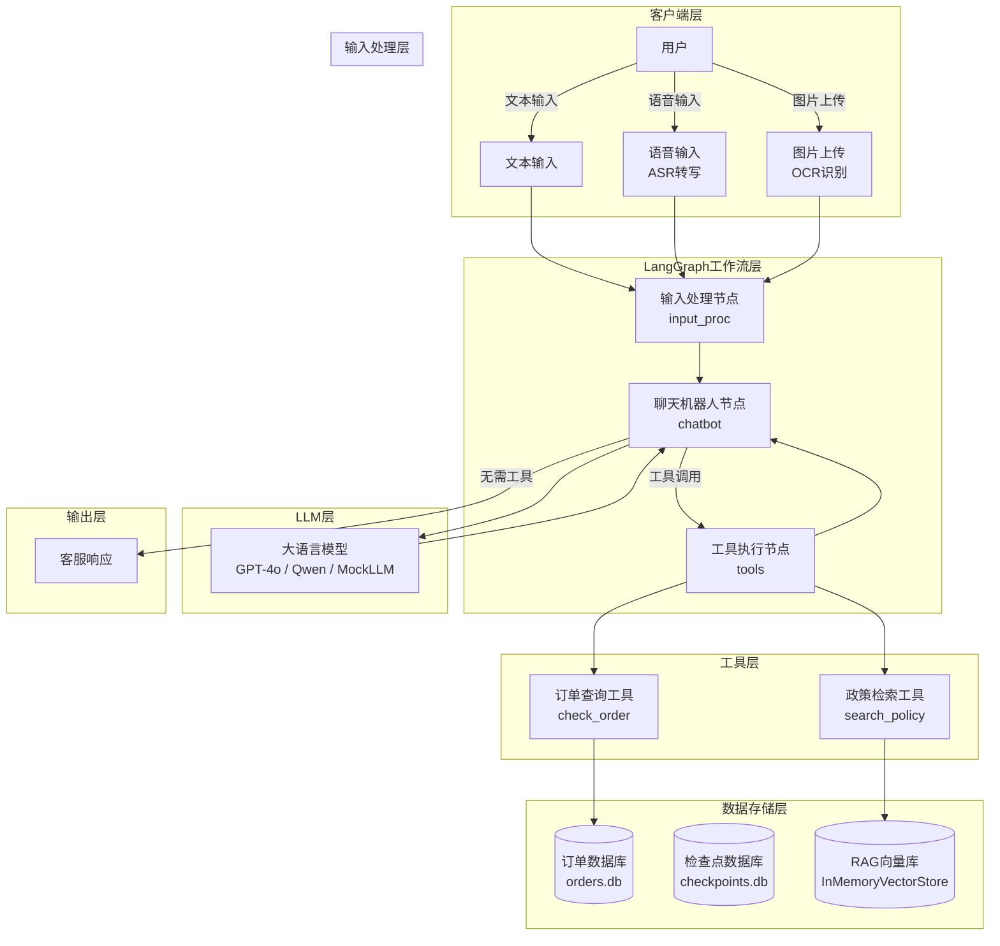
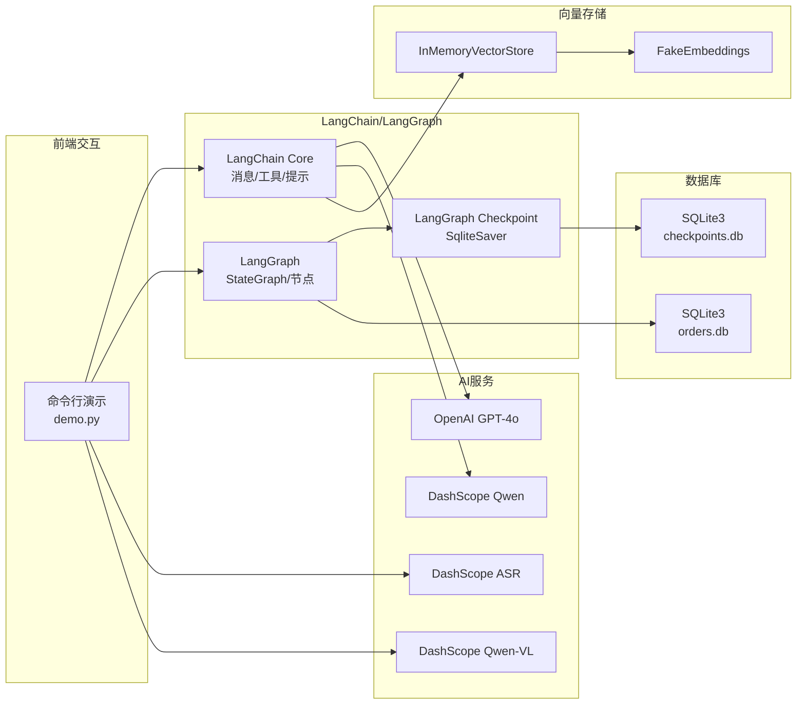
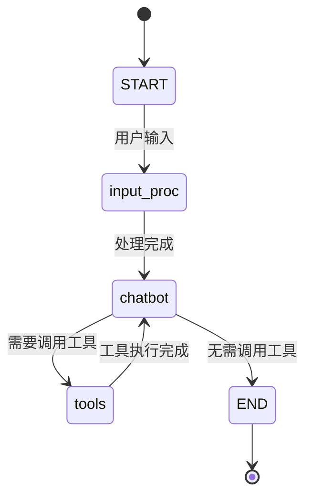
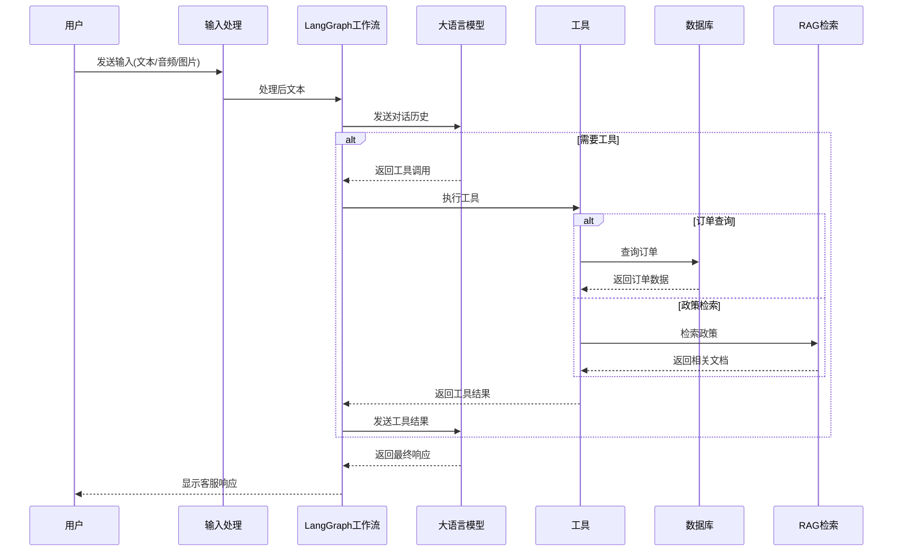

# 项目架构图

## 整体系统架构

```mermaid
graph TB
    subgraph "客户端层"
        A[用户] -->|文本输入| B
        A -->|语音输入| C
        A -->|图片上传| D
    end

    subgraph "输入处理层"
        B[文本输入]
        C[语音输入<br/>ASR转写]
        D[图片上传<br/>OCR识别]
    end

    subgraph "LangGraph工作流层"
        E[输入处理节点<br/>input_proc]
        F[聊天机器人节点<br/>chatbot]
        G[工具执行节点<br/>tools]
    end

    subgraph "工具层"
        H[订单查询工具<br/>check_order]
        I[政策检索工具<br/>search_policy]
    end

    subgraph "数据存储层"
        J[(订单数据库<br/>orders.db)]
        K[(检查点数据库<br/>checkpoints.db)]
        L[(RAG向量库<br/>InMemoryVectorStore)]
    end

    subgraph "LLM层"
        M[大语言模型<br/>GPT-4o / Qwen / MockLLM]
    end

    B --> E
    C --> E
    D --> E
    E --> F
    F -->|工具调用| G
    G --> F
    F -->|无需工具| N

    G --> H
    G --> I
    H --> J
    I --> L

    F --> M
    M --> F

    subgraph "输出层"
        N[客服响应]
    end
```

## 技术栈架构

```mermaid
graph LR
    subgraph "前端交互"
        A[命令行演示<br/>demo.py]
    end

    subgraph "LangChain/LangGraph"
        B[LangChain Core<br/>消息/工具/提示]
        C[LangGraph<br/>StateGraph/节点]
        D[LangGraph Checkpoint<br/>SqliteSaver]
    end

    subgraph "数据库"
        E[SQLite3<br/>orders.db]
        F[SQLite3<br/>checkpoints.db]
    end

    subgraph "AI服务"
        G[OpenAI GPT-4o]
        H[DashScope Qwen]
        I[DashScope ASR]
        J[DashScope Qwen-VL]
    end

    subgraph "向量存储"
        K[InMemoryVectorStore]
        L[FakeEmbeddings]
    end

    A --> B
    A --> C
    C --> D
    D --> F
    B --> G
    B --> H
    B --> K
    K --> L
    C --> E
    A --> I
    A --> J
```

## 状态流转架构

```mermaid
stateDiagram-v2
    [*] --> START
    START --> input_proc : 用户输入
    input_proc --> chatbot : 处理完成

    chatbot --> tools : 需要调用工具
    chatbot --> END : 无需调用工具

    tools --> chatbot : 工具执行完成

    END --> [*]
```

## 数据流架构

```mermaid
sequenceDiagram
    participant User as 用户
    participant Input as 输入处理
    participant LangGraph as LangGraph工作流
    participant LLM as 大语言模型
    participant Tools as 工具
    participant DB as 数据库
    participant RAG as RAG检索

    User->>Input: 发送输入(文本/音频/图片)
    Input->>LangGraph: 处理后文本
    LangGraph->>LLM: 发送对话历史
    alt 需要工具
        LLM-->>LangGraph: 返回工具调用
        LangGraph->>Tools: 执行工具
        alt 订单查询
            Tools->>DB: 查询订单
            DB-->>Tools: 返回订单数据
        else 政策检索
            Tools->>RAG: 检索政策
            RAG-->>Tools: 返回相关文档
        end
        Tools-->>LangGraph: 返回工具结果
        LangGraph->>LLM: 发送工具结果
    end
    LLM-->>LangGraph: 返回最终响应
    LangGraph-->>User: 显示客服响应
```
