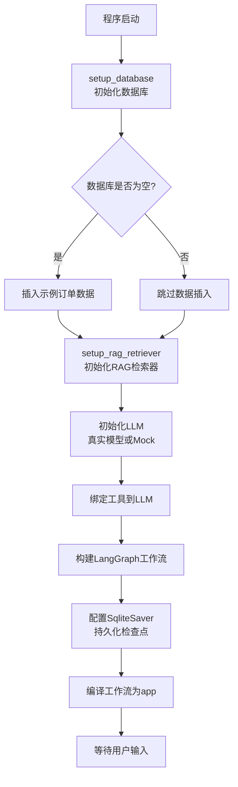
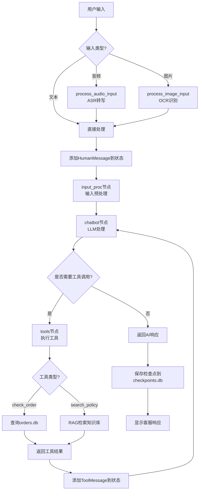
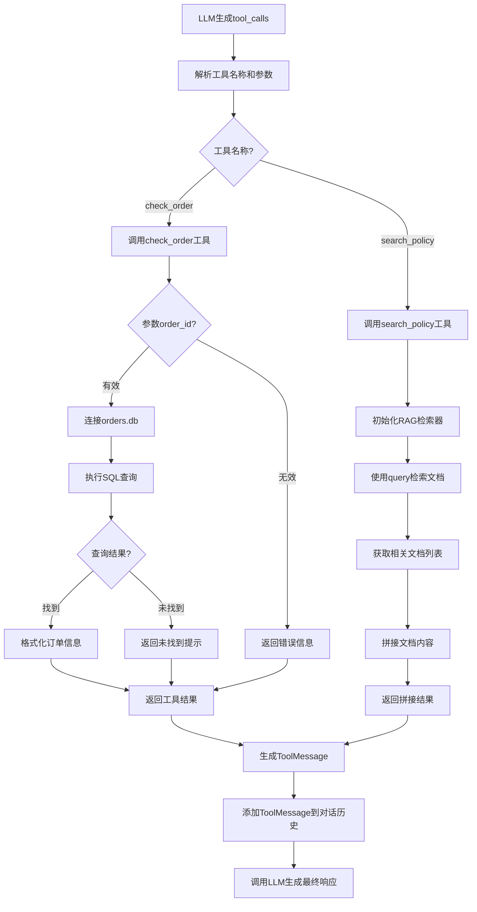
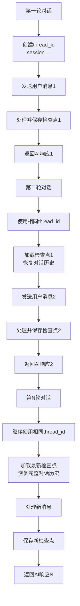
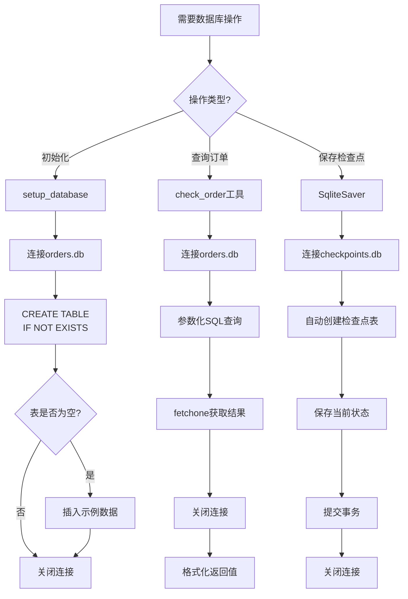

# 项目流程图

## 系统初始化流程



## 对话查询流程



## 工具调用流程



## 多轮对话流程



## RAG检索流程

```mermaid
flowchart TD
    A[用户查询政策] --> B[调用search_policy工具]
    B --> C[setup_rag_retriever<br/>初始化检索器]
    C --> D{Embeddings类型?}
    D -->|生产环境| E[OpenAIEmbeddings<br/>/DashScopeEmbeddings]
    D -->|演示环境| F[FakeEmbeddings]
    E --> G[创建InMemoryVectorStore]
    F --> G
    G --> H[从知识库加载文档]
    H --> I[将文档转换为向量]
    I --> J[存储到VectorStore]
    J --> K[retriever.invoke(query)]
    K --> L[计算查询向量]
    L --> M[搜索相似文档]
    M --> N[返回Top-K文档]
    N --> O[拼接文档内容]
    O --> P[返回给LLM]
    P --> Q[LLM基于检索内容生成回答]
```

## 数据库操作流程


