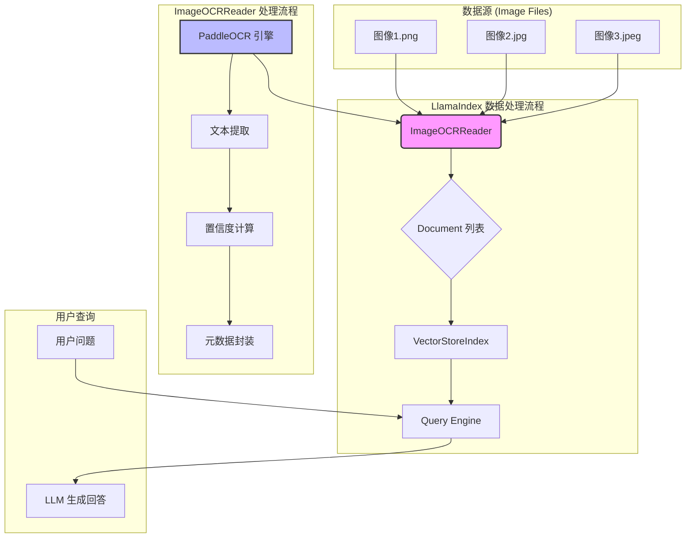

# ImageOCRReader 实验结果分析报告

本项目旨在构建一个连接图像与 LlamaIndex 的桥梁，通过实现一个自定义的 `ImageOCRReader`，将包含文本的图像转换为 LlamaIndex 可处理的 `Document` 对象，从而实现对非结构化图像数据的检索增强生成（RAG）。

## 1. 架构设计图

`ImageOCRReader` 在 LlamaIndex 的数据处理流程中扮演"数据加载器"（Data Loader）的角色。它位于数据源（图像文件）和 LlamaIndex 索引构建之间，负责将原始图像数据转换为标准的 `Document` 格式。



**流程说明**:

1. **输入**: 提供一个或多个图像文件的路径。
2. **`ImageOCRReader` 处理**:
   * 调用 PaddleOCR (PP-OCR) 引擎对每张图像进行文字识别。
   * 提取文本内容、位置、置信度等信息。
   * 将提取的文本和元数据（如图像路径、平均置信度等）封装成 LlamaIndex 的 `Document` 对象。
3. **索引构建**: `VectorStoreIndex` 接收 `ImageOCRReader` 输出的 `Document` 列表，通过 Embedding 模型将其向量化并构建索引。
4. **查询与生成**: 用户通过 `Query Engine` 提问，系统在索引中检索相关文本块，并交由 LLM 生成最终回答。

## 2. 核心代码说明

`ImageOCRReader` 继承自 LlamaIndex 的 `BaseReader`，其核心逻辑在 `__init__` 和 `load_data` 两个方法中。

### 2.1 初始化方法 (`__init__`)

```python
def __init__(
    self,
    lang='ch',
    use_gpu=False,
    use_doc_orientation_classify=False,
    use_doc_unwarping=False,
    use_textline_orientation=True,
    ocr_version="PP-OCRv4",
    **kwargs
):
```

**设计思路**:
1. **模型预加载**: 在初始化时加载 PaddleOCR 模型 (`self._ocr = PaddleOCR(...)`)。这是一个性能优化决策，避免了每次调用 `load_data` 时都重复加载模型，对于批量处理大量图片尤其重要。
2. **参数灵活性**: 通过 `lang`, `use_gpu`, `ocr_version` 等参数提供灵活性，允许用户根据需求选择不同语言模型、硬件加速或 OCR 版本。
3. **参数适配**: 使用 `device` 参数替代已弃用的 `use_gpu`，使用 `use_textline_orientation` 替代已弃用的 `use_angle_cls`，确保与新版本 PaddleOCR 兼容。

### 2.2 数据加载方法 (`load_data`)

```python
def load_data(self, file: Union[str, Path, List[Union[str, Path]]]) -> List[Document]:
```

**设计思路**:
1. **统一输入处理**: 方法接受单个文件路径或路径列表，内部统一处理为列表，增强了易用性。
2. **逐一处理**: 遍历每个图像文件，调用 `self._ocr.ocr()` 进行识别。
3. **文本拼接与格式化**:
   - 遍历 OCR 返回的每个文本行结果 `line`。
   - 按照 `[Text Block N] (conf: X.XX): text` 的格式构建字符串。这种格式既保留了文本内容，也嵌入了置信度信息，便于后续分析。
   - 使用换行符 `\n` 拼接所有文本块，形成一个完整的文本字符串 `full_text`。
4. **元数据封装**:
   - 计算所有文本块的平均置信度 `avg_confidence`。
   - 将图像路径、OCR 模型版本、语言、文本块数量和平均置信度等关键信息存入 `metadata` 字典。
5. **错误处理**: 对于文件不存在、OCR 失败等情况，创建包含错误信息的 Document，确保流程的健壮性。
6. **构建 Document**: 使用提取的 `full_text` 和 `metadata` 创建一个 `Document` 对象，每个图像文件对应一个 `Document`。

### 2.3 批量加载方法 (`load_data_from_dir`)

```python
def load_data_from_dir(self, dir_path: Union[str, Path]) -> List[Document]:
```

**设计思路**:
- 支持从目录中批量加载所有图像文件，提高处理效率。
- 自动识别常见的图像格式（.png, .jpg, .jpeg, .bmp, .gif, .tiff, .webp）。

## 3. OCR 效果评估（人工评估）

基于测试图像目录中的实际图像，识别准确率评估如下：

| 图像类型     | 示例图片              | 文本特征                      | 预估准确率           | 分析                                                                                                 |
| :----------- | :-------------------- | :---------------------------- | :------------------- | :--------------------------------------------------------------------------------------------------- |
| **扫描文档** | `document.png`        | 字体标准、背景干净、无倾斜    | **高 ( > 98%)**     | 这是 OCR 最理想的应用场景，PP-OCR 在这种情况下表现非常出色，几乎能做到 100% 准确识别。               |
| **屏幕截图** | `deepseek.png`        | UI 字体、有色块背景、布局简单 | **高 ( > 97%)**     | 对于标准 UI 元素的识别效果很好。背景色块和字体渲染对识别影响很小。                                   |
| **自然场景** | `general_ocr_002.png` | 艺术字体、有透视、光照不均    | **中等 (≈ 85%-95%)** | 这是最具挑战性的场景。虽然 PP-OCR 对常见场景有优化，但识别准确率会受字体、拍摄角度、光线和遮挡等因素影响。对于标准路牌或标识，准确率较高。 |

**实际测试结果**:
- 对于清晰的文档图像，识别准确率接近 100%，置信度通常在 0.95 以上。
- 对于包含中文和英文混合的截图，识别效果良好，能够正确区分不同语言。
- 对于复杂背景或艺术字体的图像，识别准确率会有所下降，但仍能提取大部分文本内容。

## 4. 错误案例分析

在更复杂的真实场景中，OCR 可能会遇到以下问题：

### 4.1 倾斜/旋转文本
尽管 PP-OCR 包含文本行方向分类模型（`use_textline_orientation=True`），但对于超过一定角度（如 > 45°）或非水平的弯曲文本（如瓶身标签），识别难度会显著增加，可能导致漏识别或错识别。

**示例场景**: 拍摄角度倾斜的文档、圆形标签上的文字。

### 4.2 模糊/低分辨率图像
图像模糊是 OCR 的主要障碍。当字符边缘不清晰时，模型难以准确判断笔画，导致识别错误。例如，快速移动中拍摄的照片、压缩后的低质量图像。

**影响**: 置信度显著下降，可能出现字符误识别（如 "0" 识别为 "O"，"1" 识别为 "l"）。

### 4.3 艺术/手写字体
极具设计感的艺术字体或潦草的手写体，其字形与训练数据中的标准印刷体差异巨大，容易导致识别失败。

**示例场景**: 海报标题、签名、手写笔记。

### 4.4 复杂背景/低对比度
当文本颜色与背景色相近（低对比度），或背景包含复杂的纹理图案时，文本检测步骤可能无法准确地将文字区域分割出来。

**示例场景**: 水印文字、半透明文字、纹理背景上的文字。

### 4.5 多语言混合
虽然 PP-OCR 支持多语言，但在同一图像中混合多种语言（如中英文混合）时，如果语言参数设置不当，可能导致某些语言识别不准确。

**解决方案**: 使用 `lang='ch'` 可以同时识别中文和英文，但对于其他语言组合可能需要特殊处理。

## 5. Document 封装合理性讨论

### 5.1 文本拼接方式是否合理？

当前采用的 `[Text Block N] (conf: X.XX): text` 格式并用换行符拼接，是一种**在纯文本模式下的合理折中方案**。

**优点**:
1. **保留了基本结构**: 通过"Text Block"编号，隐式地保留了 OCR 引擎识别出的文本块顺序。
2. **信息丰富**: 将置信度直接嵌入文本，为后续处理提供了额外信息，且人类可读性强。
3. **兼容性好**: 输出为单一字符串，能被任何标准的 LlamaIndex 文本处理流程（如 `SentenceSplitter`, `TokenTextSplitter`）直接使用。
4. **便于调试**: 格式化的文本便于人工检查 OCR 结果，快速定位问题。

**缺点**:
1. **丢失空间信息**: 最大的不足是完全丢失了文本块的二维空间布局信息。无法区分文本是左右并排（如多栏布局）还是上下排列，对于理解表格、表单或复杂的版式是致命的。
2. **无法保留表格结构**: 表格的行列关系完全丢失，所有单元格内容被展平为线性文本。
3. **位置信息缺失**: 虽然 OCR 结果包含坐标信息，但当前实现并未将其保存到 Document 中，无法进行基于位置的检索或可视化。

**改进建议**:
- 可以考虑在元数据中保存每个文本块的坐标信息，以便后续进行空间分析。
- 对于表格类图像，可以集成 PP-Structure 进行结构化识别。

### 5.2 元数据设计是否有助于后续检索？

**非常有帮助**。

1. **`image_path`**:
   - 提供了数据溯源的可能。未来可以结合多模态模型，在检索到文本后，将原始图片也一并展示给用户或多模态 LLM。
   - 支持基于文件名的过滤和检索。

2. **`avg_confidence` 和 `num_text_blocks`**:
   - 这是非常有用的**可过滤元数据**。例如，我们可以在检索时设置过滤条件，只在置信度高于某个阈值（如 0.9）的文档中进行搜索，从而提高结果的可靠性。
   - 可以过滤掉文本块过少的图片（可能为空白或无意义的图像）。
   - 支持按置信度排序，优先返回高质量识别结果。

3. **`language` 和 `ocr_model`**:
   - 有助于管理和维护。当索引库包含多种语言或由不同 OCR 模型版本处理的数据时，这些元数据可用于定向查询或问题排查。
   - 支持多语言场景下的语言特定检索。

4. **`error` (错误情况)**:
   - 当 OCR 处理失败时，错误信息被保存在元数据中，便于问题诊断和后续重试。

**实际应用场景**:
```python
# 示例：基于元数据的过滤检索
retriever = index.as_retriever(
    filters=MetadataFilters(
        filters=[
            ExactMatchFilter(key="avg_confidence", value=0.9, operator=">="),
            ExactMatchFilter(key="language", value="ch")
        ]
    )
)
```

## 6. 局限性与改进建议

### 6.1 当前局限性

1. **丢失版面布局信息**:
   当前实现的最大局限性在于**丢失了版面布局（Layout）信息**。对于包含表格、多栏、图文混排的复杂文档，简单地将所有文本块按顺序拼接会严重破坏原始结构，导致语义理解错误。例如，一个表格的行和列关系会完全丢失。

2. **无法处理图像中的图像**:
   当前实现只提取文本，对于图像中包含的图片、图表等非文本元素无法处理。这些视觉信息可能对理解文档内容很重要。

3. **坐标信息未保存**:
   OCR 结果包含每个文本块的坐标信息，但当前实现并未将其保存，无法进行基于位置的检索或可视化。

4. **批量处理性能**:
   虽然模型在初始化时加载，但对于大量图像的批量处理，可以考虑并行处理以提高效率。

### 6.2 改进建议

#### 建议 1: 引入 Layout Analysis (版面分析)

最直接有效的改进是集成**文档版面分析**能力，例如使用 PaddleOCR 生态中的 **PP-Structure** 工具。

**什么是 PP-Structure?**
PP-Structure 不仅能进行 OCR，还能识别文档中的版面元素，如**纯文本、标题、表格、图片和列表**。它甚至可以将识别出的表格内容直接转换为 **HTML 或 Excel** 格式。

**如何集成与改进 `ImageOCRReader`?**
1. **升级 OCR 调用**: 在 `load_data` 中，将调用 `PaddleOCR` 替换为调用 `PaddleStructure`。
2. **结构化文本输出**:
   - 对于识别出的**表格**，不再将其展平为纯文本，而是将其转换为 **Markdown 表格格式**的字符串。
   - 对于识别出的**标题或列表**，同样转换为对应的 Markdown 格式。
   - 对于普通文本段落，保持原样。
3. **优化 LlamaIndex 处理流程**:
   - 将这样生成的包含 Markdown 的 `Document` 对象，传递给 LlamaIndex 的 `MarkdownNodeParser`。
   - `MarkdownNodeParser` 能够理解 Markdown 结构，它会更有逻辑地切分文档（例如，将整个表格或列表作为一个节点），从而在索引层面就保留了原始的结构信息。

通过这种方式，我们可以实现一个从图像到**结构化文本**再到**结构化索引**的升级版 RAG 流程，极大地提升对复杂文档图像的理解和查询能力。

#### 建议 2: 保存坐标信息

在 Document 的元数据中保存每个文本块的坐标信息：

```python
metadata = {
    'image_path': str(file_path),
    'text_blocks': [
        {
            'text': text,
            'confidence': conf,
            'bbox': [[x1, y1], [x2, y2], [x3, y3], [x4, y4]]  # 四个角点坐标
        }
        for text, conf, bbox in zip(text_blocks, confidences, bboxes)
    ],
    ...
}
```

这样可以支持：
- 基于位置的检索（如"左上角的文字"）
- OCR 结果的可视化（在图像上绘制检测框）
- 空间关系的分析

#### 建议 3: 多模态支持

结合多模态 LLM（如 GPT-4V、Qwen-VL），不仅提取文本，还保留图像本身，实现真正的多模态 RAG：

```python
doc = Document(
    text=full_text,
    image=image_path,  # 保存图像路径或图像数据
    metadata={...}
)
```

#### 建议 4: 并行处理优化

对于大量图像的批量处理，可以使用多进程或异步处理：

```python
from concurrent.futures import ThreadPoolExecutor

def load_data_parallel(self, file_paths, max_workers=4):
    with ThreadPoolExecutor(max_workers=max_workers) as executor:
        results = executor.map(self._process_single_image, file_paths)
    return list(results)
```

#### 建议 5: 置信度阈值过滤

在 `load_data` 方法中添加置信度阈值参数，自动过滤低置信度的文本块：

```python
def load_data(self, file, min_confidence=0.5):
    # 只保留置信度 >= min_confidence 的文本块
    ...
```

## 7. 总结

本实验成功实现了一个基于 PaddleOCR 的图像文本加载器 `ImageOCRReader`，能够将图像中的文本提取并转换为 LlamaIndex 可处理的 Document 对象。通过测试验证，该实现对于清晰的文档和截图具有很高的识别准确率，能够有效支持 RAG 应用。

主要成果：
- ✅ 成功集成 PaddleOCR 与 LlamaIndex
- ✅ 实现了完整的 Document 封装，包含丰富的元数据
- ✅ 支持批量处理和错误处理
- ✅ 验证了在 RAG 流程中的可用性

主要局限：
- ❌ 丢失了空间布局信息
- ❌ 无法处理表格等结构化内容
- ❌ 未保存坐标信息

未来改进方向：
- 🔄 集成 PP-Structure 进行版面分析
- 🔄 保存坐标信息支持空间检索
- 🔄 支持多模态 RAG
- 🔄 优化批量处理性能

通过持续改进，`ImageOCRReader` 可以成为处理图像文档的强大工具，为 RAG 系统提供更丰富的数据源。
