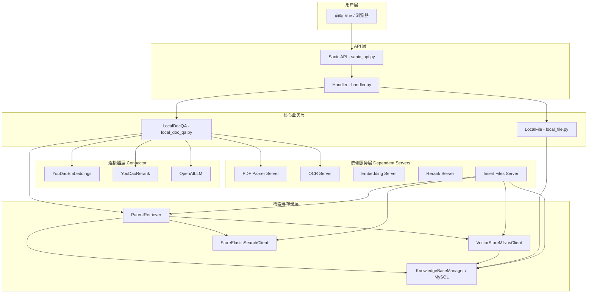
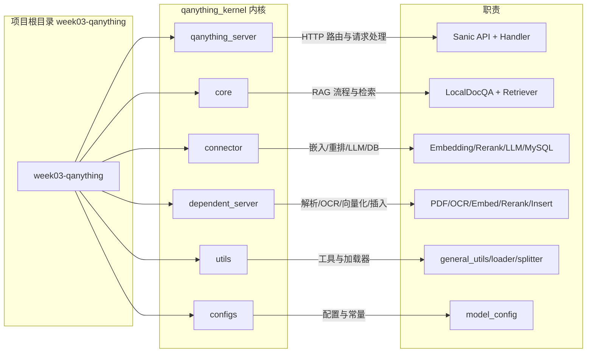
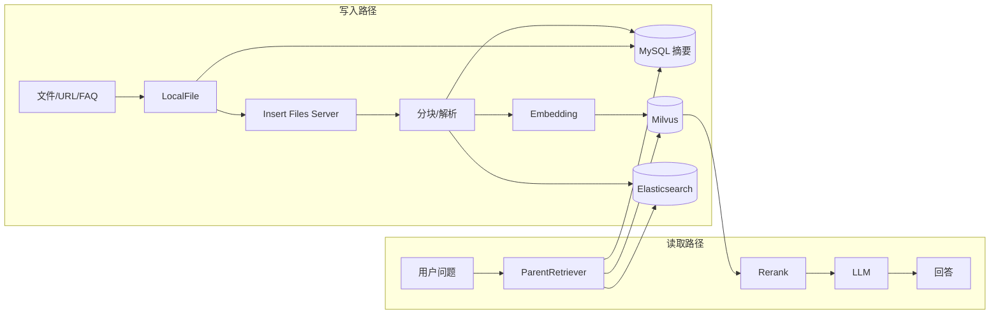
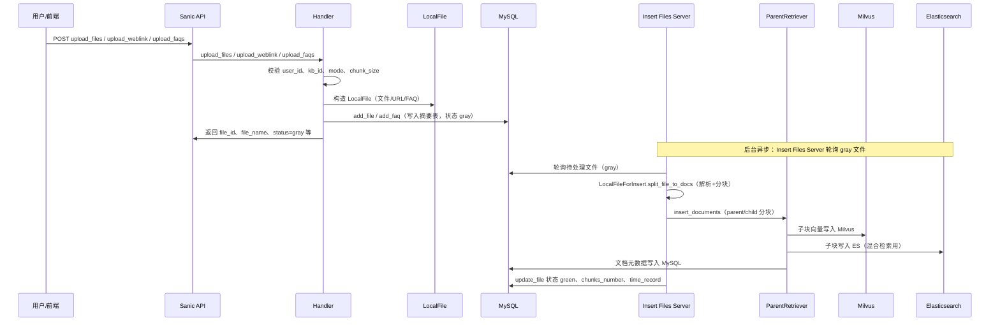
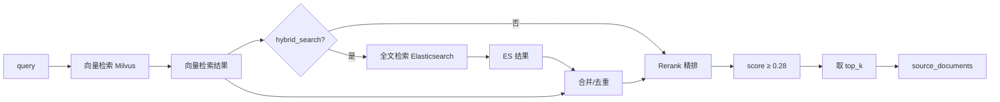
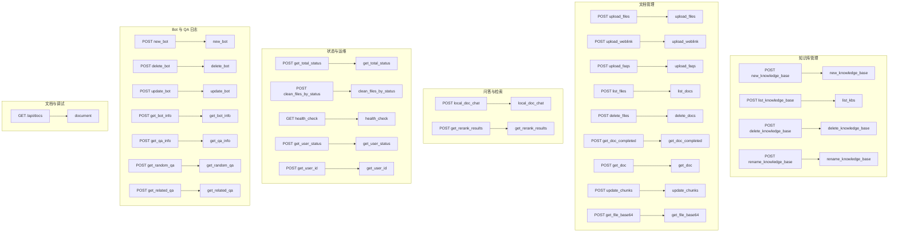
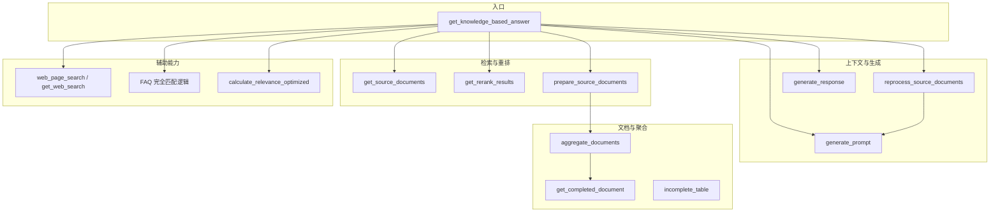
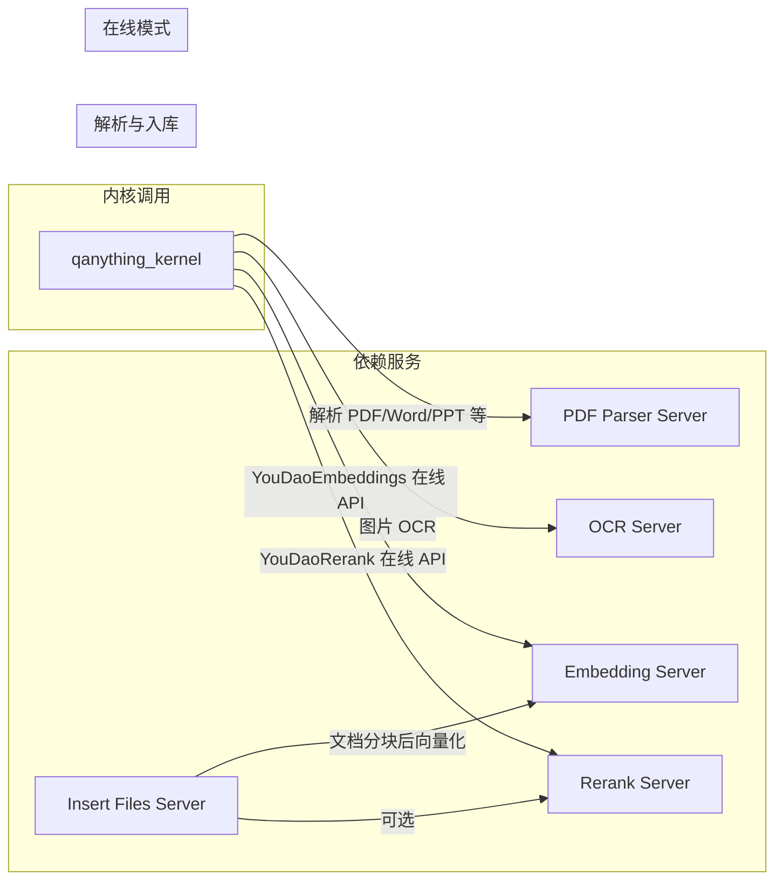

# QAnything 项目架构、流程图与功能说明

本文档描述 week03-qanything 项目的系统架构、核心流程与功能模块，便于理解与二次开发。

---

## 一、系统架构图

### 1.1 整体分层架构



### 1.2 目录与模块对应关系



### 1.3 数据流与存储组件



---

## 二、核心流程图

### 2.1 文件上传与入库流程



### 2.2 知识库问答流程（local_doc_chat）

```mermaid
flowchart TB
    START([用户提问]) --> A{是否有对话历史?}
    A -->|是| B[多轮改写: RewriteQuestionChain]
    A -->|否| C[retrieval_query = query]
    B --> C
    B --> COND[condense_question]

    C --> D{是否有 kb_ids?}
    D -->|是| E[get_source_documents 知识库检索]
    D -->|否| F[source_documents = []]

    E --> G{need_web_search?}
    F --> G
    G -->|是| H[web_page_search 联网检索]
    G -->|否| I[合并结果]
    H --> I

    I --> J[deduplicate_documents 去重]
    J --> K{rerank 且 doc>1?}
    K -->|是| L[Rerank 精排 + score≥0.28 + 相对高分过滤]
    K -->|否| M[取 top_k]
    L --> M

    M --> N[去掉 headers 行]
    N --> O{存在高分 FAQ?}
    O -->|是| P[仅保留 FAQ 文档]
    O -->|否| Q[FAQ 完全匹配?]
    P --> Q
    Q -->|是| R[直接返回 FAQ answer]
    Q -->|否| S[选择 prompt 模板]

    S --> T[reprocess_source_documents 按 token 裁切]
    T --> U[generate_prompt 生成 prompt]
    U --> V{only_need_search_results?}
    V -->|是| W[返回 source_documents]
    V -->|否| X[LLM 流式/非流式生成]

    X --> Y{有图片?}
    Y -->|是| Z[calculate_relevance_optimized 选相关文档与 show_images]
    Y -->|否| END([返回回答与来源])
    Z --> END
```

### 2.3 检索流程（混合检索 + 重排）



---

## 三、功能模块图

### 3.1 API 接口与 Handler 对应关系



### 3.2 LocalDocQA 核心方法关系



### 3.3 依赖服务与内核调用关系



---

## 四、功能说明汇总

### 4.1 按模块划分

| 模块 | 路径 | 职责 |
|------|------|------|
| **API 入口** | `qanything_server/sanic_api.py` | Sanic 应用、路由注册、before_server_start 初始化 LocalDocQA |
| **请求处理** | `qanything_server/handler.py` | 所有 API 的请求校验、参数解析、调用 LocalDocQA/MySQL/Milvus/ES、返回 JSON 或 SSE 流 |
| **RAG 核心** | `core/local_doc_qa.py` | 检索、重排、token 裁切、prompt 生成、LLM 调用、FAQ 匹配、联网搜索、带图回答 |
| **本地文件** | `core/local_file.py` | 上传文件/URL/FAQ 的封装，生成 file_id、落盘或标记 URL/FAQ |
| **检索器** | `core/retriever/parent_retriever.py` | ParentRetriever：向量检索（Milvus）+ 可选全文检索（ES）、parent/child 分块与插入 |
| **向量库** | `core/retriever/vectorstore.py` | Milvus 封装，向量写入与相似度检索 |
| **全文检索** | `core/retriever/elasticsearchstore.py` | Elasticsearch 封装，关键词检索 |
| **嵌入** | `connector/embedding/embedding_for_online_client.py` | YouDaoEmbeddings，文本转向量（在线） |
| **重排** | `connector/rerank/rerank_for_online_client.py` | YouDaoRerank，检索结果精排（在线） |
| **LLM** | `connector/llm/llm_for_openai_api.py` | OpenAI 兼容 API 调用，流式/非流式 |
| **知识库元数据** | `connector/database/mysql/mysql_client.py` | 知识库/文件/文档/FAQ/Bot/QA 日志等 MySQL 读写 |
| **文件插入服务** | `dependent_server/insert_files_serve/insert_files_server.py` | 轮询 gray 文件，解析→分块→向量化→写 Milvus/ES/MySQL，更新状态为 green |
| **PDF 解析** | `dependent_server/pdf_parser_server/` | PDF/Word/PPT 等解析为 Markdown/结构化内容 |
| **OCR** | `dependent_server/ocr_server/` | 图片文字识别 |
| **配置** | `configs/model_config.py` | 路径、LLM 模板、分块大小、检索 top_k 等常量 |

### 4.2 按业务流程划分

| 流程 | 涉及接口与核心类 | 说明 |
|------|------------------|------|
| **创建知识库** | `new_knowledge_base` → MySQL + Milvus | 校验 user_id、生成或校验 kb_id、建 Milvus base |
| **上传文件** | `upload_files` → LocalFile、MySQL | 校验 kb_id/数量/大小，落盘，写摘要表 gray，Insert 服务异步入库 |
| **上传链接** | `upload_weblink` → LocalFile、MySQL | URL 拉取、标题清理、同上 |
| **上传 FAQ** | `upload_faqs` → LocalFile、MySQL、FAQ 表 | 写入 FAQ 表与文件表，状态 gray，异步向量化 |
| **列举知识库/文件** | `list_kbs` / `list_docs` → MySQL | 分页、按状态统计、FAQ 附带 question/answer |
| **删除知识库/文件** | `delete_knowledge_base` / `delete_docs` | 异步删 Milvus/ES，删 MySQL 记录与本地目录 |
| **问答** | `local_doc_chat` → LocalDocQA | 多轮改写→检索→去重→重排→FAQ 匹配→裁切 token→生成 prompt→LLM→可选带图 |
| **仅检索** | `local_doc_chat(only_need_search_results=True)` 或 `get_rerank_results` | 只返回检索/重排结果，不调用 LLM |
| **Bot 管理** | `new_bot` / `update_bot` / `delete_bot` / `get_bot_info` | Bot 元数据与绑定知识库、LLM 配置的增删改查 |
| **QA 日志** | `get_qa_info` / `get_random_qa` / `get_related_qa` | 按条件查询、按天统计、导出 Excel、随机/关联 QA |

---

## 五、关键设计要点

1. **两阶段检索**：先向量检索（+ 可选 ES 混合），再 Rerank 精排并过滤低分，缓解数据量增大时的检索退化。
2. **Parent-Child 分块**：大块（parent）存 MySQL 用于展示与聚合，小块（child）做向量与关键词检索，兼顾上下文与召回。
3. **异步入库**：上传接口只写摘要表（gray），Insert Files Server 轮询 gray 文件并完成解析、分块、向量写入与状态更新（green）。
4. **多租户与权限** | `user_id` + `user_info` 拼接为内部 user_id，知识库与文件均按 user 隔离；Bot 绑定 kb_ids 与 LLM 配置。
5. **流式与仅检索**：`streaming=True` 时 SSE 流式返回；`only_need_search_results=True` 时仅返回检索结果，不调用 LLM。

---

以上架构图、流程图与功能说明均基于当前代码结构整理，可作为阅读代码与扩展功能的参考。若需导出为 PNG/SVG，可使用支持 Mermaid 的编辑器或 [Mermaid Live](https://mermaid.live/) 打开本 Markdown 渲染后导出。
