# local_doc_qa.py 与各组件流程图、架构图与脑图

本文档基于 `qanything_kernel/core/local_doc_qa.py` 绘制其与各组件的关系、主流程与方法脑图。所有图均为 Mermaid 语法，可在支持 Mermaid 的 Markdown 预览或 [Mermaid Live](https://mermaid.live/) 中渲染。

---

## 一、架构图：LocalDocQA 与各组件关系

### 1.1 组件依赖架构（谁依赖谁）

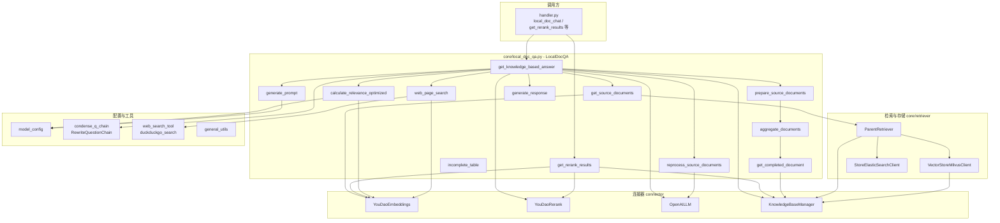

### 1.2 数据流架构（数据在组件间如何流动）

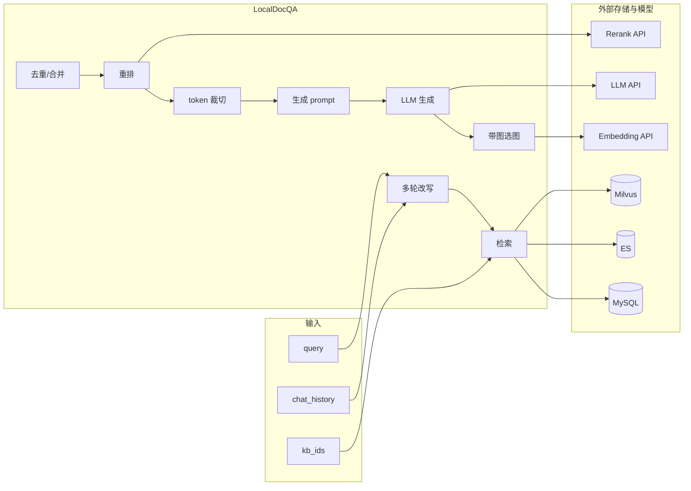

---

## 二、流程图：LocalDocQA 主流程与子流程

### 2.1 主入口 get_knowledge_based_answer 总览

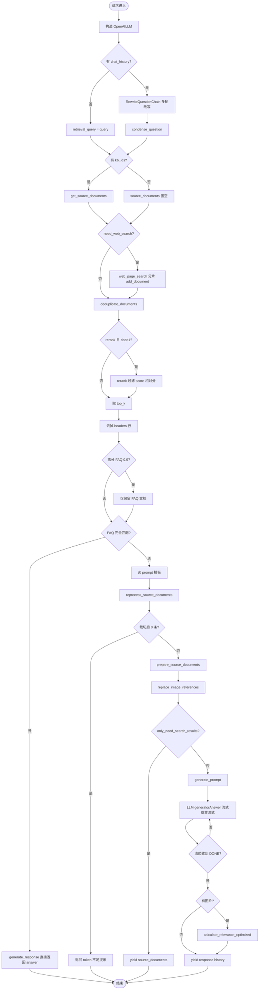

### 2.2 get_source_documents 与检索组件

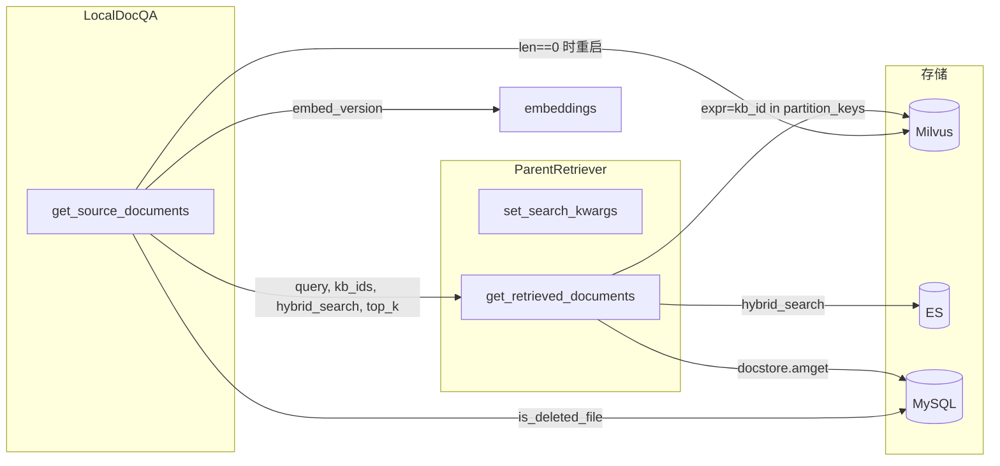

### 2.3 reprocess_source_documents 与 token 裁切

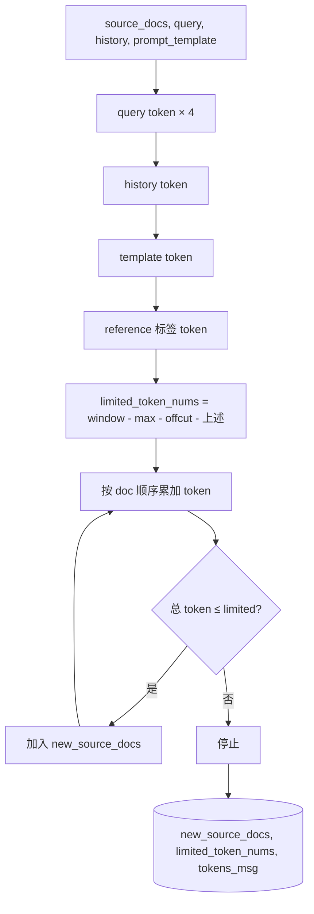

### 2.4 get_rerank_results 与 Embedding/Rerank 组件

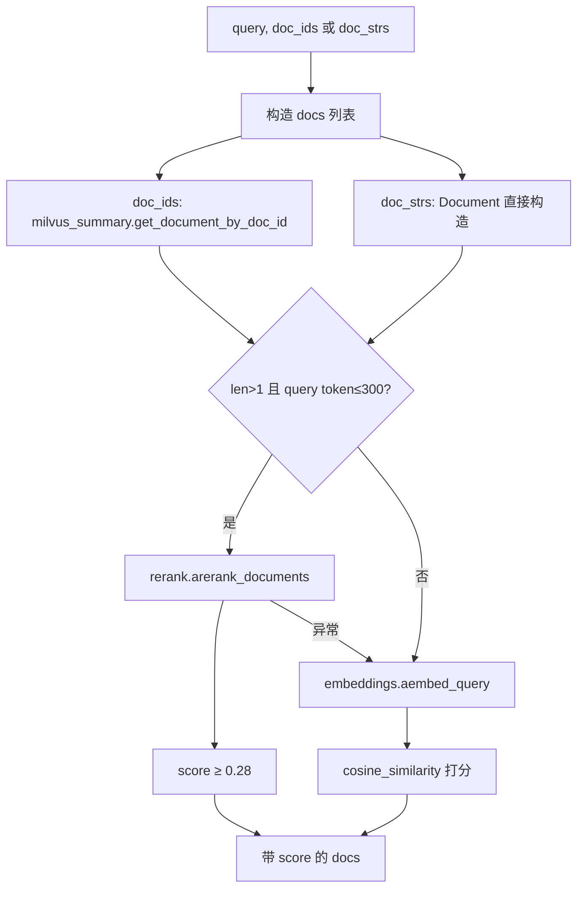

### 2.5 calculate_relevance_optimized 与 Embedding/KD 树

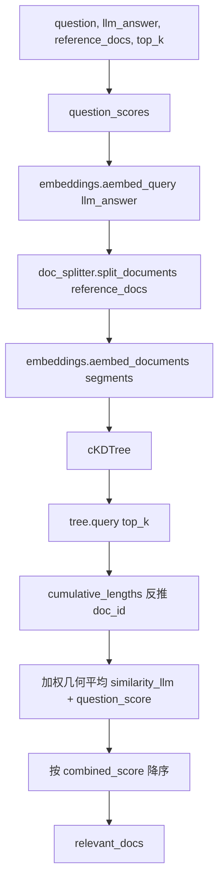

---

## 三、脑图：LocalDocQA 类结构与方法关系

### 3.1 类属性与初始化依赖

```mermaid
mindmap
  root((LocalDocQA))
    初始化 __init__ port
      milvus_cache
      embeddings YouDaoEmbeddings
      rerank YouDaoRerank
      chunk_conent
      score_threshold
      milvus_kb VectorStoreMilvusClient
      retriever ParentRetriever
      milvus_summary KnowledgeBaseManager
      es_client StoreElasticSearchClient
      session create_retry_session
      doc_splitter CharacterTextSplitter
    init_cfg
      embeddings = YouDaoEmbeddings
      rerank = YouDaoRerank
      milvus_summary = KnowledgeBaseManager
      milvus_kb = VectorStoreMilvusClient
      es_client = StoreElasticSearchClient
      retriever = ParentRetriever
```

### 3.2 方法分类脑图（按职责）

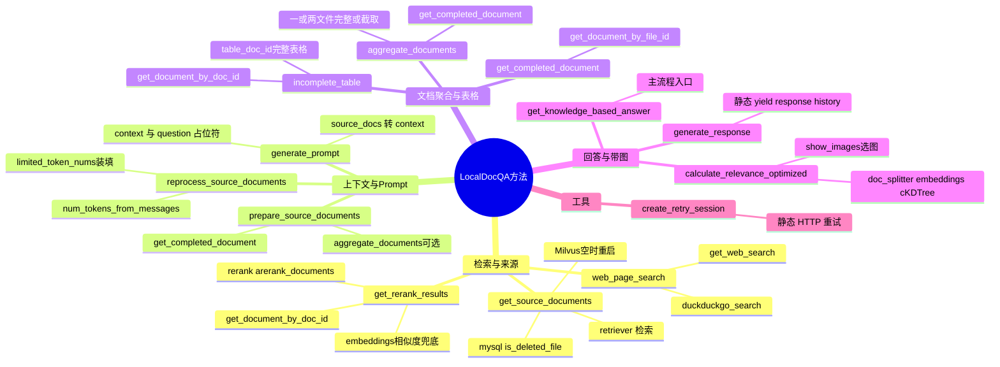

### 3.3 方法调用关系脑图（谁调谁）

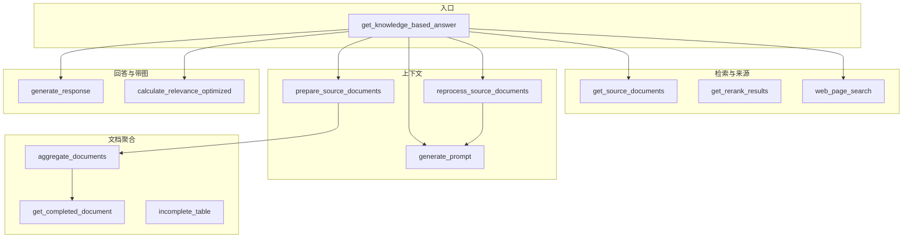

---

## 四、与 handler 的对接关系

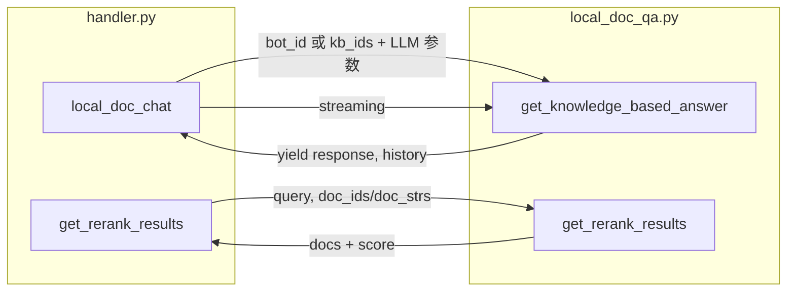

---

## 五、小结表：方法 ↔ 组件

| LocalDocQA 方法 | 直接依赖组件 | 说明 |
|------------------|--------------|------|
| `__init__` | 无（仅 port） | 属性占位，由 init_cfg 赋值 |
| `init_cfg` | YouDaoEmbeddings, YouDaoRerank, KnowledgeBaseManager, VectorStoreMilvusClient, StoreElasticSearchClient, ParentRetriever | 组装完整 RAG 栈 |
| `create_retry_session` | requests | HTTP 重试会话 |
| `get_web_search` | duckduckgo_search, self.embeddings.embed_version | 联网搜索并统一 Document 格式 |
| `web_page_search` | get_web_search | 对外封装，异常返回 [] |
| `get_source_documents` | ParentRetriever, VectorStoreMilvusClient, self.embeddings.embed_version, retriever.mysql_client | 检索 + 过滤已删 + 写 embed_version/score |
| `reprocess_source_documents` | OpenAILLM.num_tokens_from_messages | 算 token、按 limited 装填文档 |
| `generate_prompt` | 无（仅 config 模板字符串） | source_docs → context，替换 {{context}} {{question}} |
| `get_rerank_results` | milvus_summary, self.embeddings, self.rerank, cosine_similarity | doc 取内容 → 重排或向量打分 |
| `prepare_source_documents` | aggregate_documents（当前被 return 短路） | 可选聚合一/两文件 |
| `calculate_relevance_optimized` | self.embeddings, self.doc_splitter, cKDTree, gmean | 带图回答时选最相关 doc 与 show_images |
| `generate_response` | 无 | 静态，拼 response 与 history 并 yield |
| `get_knowledge_based_answer` | OpenAILLM, RewriteQuestionChain, get_source_documents, web_page_search, milvus_summary.add_document, deduplicate_documents, self.rerank, reprocess_source_documents, prepare_source_documents, generate_prompt, custom_llm.generatorAnswer, calculate_relevance_optimized, generate_response | 主流程入口 |
| `get_completed_document` | milvus_summary.get_document_by_file_id | 按 file_id 取分块并拼成完整文档 |
| `aggregate_documents` | get_completed_document, custom_llm.num_tokens_from_docs | 一/两文件内完整或按 doc_id 范围截取 |
| `incomplete_table` | milvus_summary.get_document_by_doc_id | 表格片段替换为完整表格 doc |

---

以上图表均基于当前 `local_doc_qa.py` 代码整理，便于阅读与维护。若需导出为 PNG/SVG，可使用 [Mermaid Live](https://mermaid.live/) 粘贴对应代码块渲染后导出。
