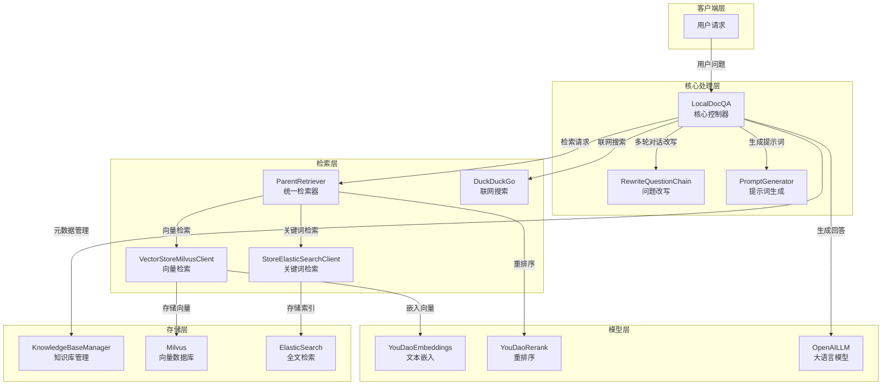

# QAnything 系统架构与核心功能详解

## 1. 系统概述

QAnything 是一个基于 RAG（Retrieval-Augmented Generation）技术的智能文档问答系统，专为企业级知识库构建和智能问答场景设计。系统通过融合向量检索、关键词检索、重排序等技术，实现了高质量的文档问答能力，同时支持联网搜索、多轮对话、流式输出等高级功能。

### 核心价值

- **精准回答**：基于检索增强生成，确保回答的准确性和可追溯性
- **多源知识融合**：整合本地知识库和网络信息，提供全面的知识覆盖
- **智能处理**：支持文档分块、重排序、Token 优化等高级处理策略
- **用户友好**：支持流式输出、多轮对话、图片引用等交互增强功能

## 2. 系统架构

QAnything 采用模块化设计，各组件职责清晰，耦合度低，便于扩展和维护。整体架构分为以下几层：

### 2.1 核心组件架构



### 2.2 核心类与职责

| 类名 | 主要职责 | 关键功能 |
|------|---------|----------|
| LocalDocQA | 系统核心控制器，协调各组件完成 RAG 流程 | 文档检索、重排序、上下文构建、问答生成 |
| ParentRetriever | 统一检索器，整合多种检索策略 | 向量检索 + 关键词检索 + 混合检索 |
| VectorStoreMilvusClient | Milvus 向量库客户端 | 向量索引管理、相似度搜索 |
| StoreElasticSearchClient | ElasticSearch 客户端 | 全文检索、关键词匹配 |
| YouDaoEmbeddings | 文本嵌入模型 | 将文本转换为高维向量 |
| YouDaoRerank | 重排序模型 | 对检索结果进行精确排序 |
| OpenAILLM | LLM 客户端 | 与大语言模型交互，生成回答 |
| KnowledgeBaseManager | 知识库管理器 | 管理知识库元数据和文档索引 |
| RewriteQuestionChain | 问题改写链 | 多轮对话时优化问题表达 |

## 3. 核心功能详解

### 3.1 RAG 核心流程

QAnything 的 RAG 流程设计精巧，包含以下关键步骤：

1. **问题处理**：多轮对话时进行问题改写，确保问题表达准确
2. **文档检索**：从知识库和网络检索相关文档
3. **重排序**：对检索结果进行精确排序，提高相关性
4. **上下文构建**：智能处理 Token 限制，构建最优的 Prompt 上下文
5. **回答生成**：基于检索到的文档生成准确回答
6. **结果处理**：处理流式输出、图片引用等

#### 核心流程代码示例

```python
async def get_knowledge_based_answer(self, model, max_token, kb_ids, query, retriever, custom_prompt, time_record,
                                     chat_history=None, streaming: bool = STREAMING, rerank: bool = False,
                                     only_need_search_results: bool = False, need_web_search=False,
                                     hybrid_search=False):
    # 1. 多轮对话改写问题
    if chat_history:
        # 格式化对话历史
        formatted_chat_history = []
        for msg in chat_history:
            formatted_chat_history += [
                HumanMessage(content=msg[0]),
                AIMessage(content=msg[1]),
            ]
        # 问题改写
        rewrite_q_chain = RewriteQuestionChain(model_name=model, openai_api_base=api_base, openai_api_key=api_key)
        condense_question = await rewrite_q_chain.condense_q_chain.ainvoke(
            {
                "chat_history": formatted_chat_history,
                "question": query,
            },
        )

    # 2. 知识库检索
    if kb_ids:
        source_documents = await self.get_source_documents(retrieval_query, retriever, kb_ids, time_record,
                                                           hybrid_search, top_k)

    # 3. 可选：联网搜索
    if need_web_search:
        web_search_results = self.web_page_search(query, top_k=3)
        # 分片处理
        web_splitter = RecursiveCharacterTextSplitter(
            separators=SEPARATORS,
            chunk_size=web_chunk_size,
            chunk_overlap=int(web_chunk_size / 4),
            length_function=num_tokens_embed,
        )
        web_search_results = web_splitter.split_documents(web_search_results)
        source_documents += web_search_results

    # 4. 去重与重排序
    source_documents = deduplicate_documents(source_documents)
    if rerank and len(source_documents) > 1:
        source_documents = await self.rerank.arerank_documents(condense_question, source_documents)
        # 过滤低分文档
        source_documents = [doc for doc in source_documents if doc.metadata['score'] >= 0.28]

    # 5. FAQ 匹配
    # 若存在高分 FAQ（≥0.9），则仅用 FAQ 作为来源
    high_score_faq_documents = [doc for doc in source_documents if
                                doc.metadata['file_name'].endswith('.faq') and doc.metadata['score'] >= 0.9]
    if high_score_faq_documents:
        source_documents = high_score_faq_documents
    # FAQ 完全匹配：直接返回答案
    for doc in source_documents:
        if doc.metadata['file_name'].endswith('.faq') and clear_string_is_equal(
                doc.metadata['faq_dict']['question'], query):
            res = doc.metadata['faq_dict']['answer']
            # 直接返回 FAQ 答案
            return res

    # 6. Token 优化与上下文构建
    retrieval_documents, limited_token_nums, tokens_msg = self.reprocess_source_documents(
        custom_llm=custom_llm,
        query=query,
        source_docs=source_documents,
        history=chat_history,
        prompt_template=prompt_template
    )

    # 7. 生成 Prompt
    prompt = self.generate_prompt(
        query=query,
        source_docs=source_documents,
        prompt_template=prompt_template
    )

    # 8. 流式/非流式调用 LLM
    async for answer_result in custom_llm.generatorAnswer(prompt=prompt, history=chat_history, streaming=streaming):
        # 处理流式输出
        resp = answer_result.llm_output["answer"]
        # 返回结果
        yield response, history
```

### 3.2 多模态检索策略

QAnything 采用多模态检索策略，结合向量检索和关键词检索的优势，提高文档召回率和准确性：

#### 3.2.1 向量检索

基于 Milvus 向量数据库，使用 YouDaoEmbeddings 模型将文本转换为高维向量，通过计算向量相似度进行语义检索。适合处理自然语言问题，能够理解用户意图的语义相似性。

#### 3.2.2 关键词检索

基于 ElasticSearch 全文检索引擎，通过关键词匹配进行精确检索。适合处理包含专业术语、代码、公式等需要精确匹配的问题。

#### 3.2.3 混合检索

将向量检索和关键词检索的结果融合，通过权重调整实现最优检索效果。系统会根据问题类型自动选择合适的检索策略，或使用混合检索提高召回率。

### 3.3 智能重排序

为了解决向量检索可能的语义偏差问题，QAnything 引入了专门的重排序模块：

1. **重排序模型**：使用 YouDaoRerank 模型对检索结果进行精确排序
2. **分数过滤**：过滤得分低于阈值（0.28）的文档，提高结果质量
3. **相对分数过滤**：过滤与最高分相差超过 50% 的文档，确保结果的一致性
4. **容错机制**：重排序失败时退化为向量相似度打分，保证系统稳定性

### 3.4 Token 优化策略

在 LLM 上下文窗口有限的情况下，QAnything 实现了智能 Token 优化策略，最大化信息利用：

1. **精确计算**：精确计算各部分 Token 消耗，包括查询、历史、模板、引用标签等
2. **优先级排序**：优先保留高质量文档，确保重要信息不被丢弃
3. **智能截断**：在 Token 不足时，智能截断文档而不是简单丢弃
4. **重复过滤**：过滤重复文档，减少冗余信息的 Token 消耗

### 3.5 多轮对话处理

QAnything 支持多轮对话，通过问题改写实现上下文理解：

1. **对话历史管理**：维护多轮对话历史，确保上下文连续性
2. **问题改写**：使用 RewriteQuestionChain 对用户问题进行改写，融入历史信息
3. **历史长度控制**：自动控制对话历史长度，避免 Token 溢出
4. **相似度判断**：判断改写后的问题与原始问题是否相似，决定是否使用改写结果

### 3.6 联网搜索能力

QAnything 集成了 DuckDuckGo 搜索引擎，能够扩展知识来源：

1. **搜索结果处理**：将搜索结果转换为与知识库文档一致的格式
2. **结果分片**：对长搜索结果进行分片处理，适应 Token 限制
3. **结果融合**：将搜索结果与知识库检索结果融合，提供全面回答
4. **容错机制**：联网搜索失败时不影响主流程，保证系统稳定性

### 3.7 FAQ 快速匹配

QAnything 针对常见问题场景，实现了 FAQ 快速匹配功能：

1. **高分 FAQ 优先**：当检索到高分 FAQ（≥0.9）时，优先使用 FAQ 作为回答来源
2. **完全匹配短路**：当用户问题与 FAQ 问题完全匹配时，直接返回 FAQ 答案，不调用 LLM
3. **格式优化**：将 FAQ 格式化为「问题：答案」的形式，提高可读性

### 3.8 图片引用能力

QAnything 支持文档中的图片引用，提高回答的可视化效果：

1. **图片检测**：检测文档中的图片引用
2. **相关性计算**：根据 LLM 回答与文档的相似度，选择最相关的图片
3. **图片整合**：将相关图片整合到回答中，提高回答质量
4. **格式处理**：统一图片引用格式，确保在不同平台的显示效果

## 4. 技术栈与依赖

| 技术/依赖 | 用途 | 版本/说明 |
|-----------|------|-----------|
| Python 3.8+ | 开发语言 | 核心运行环境 |
| Milvus | 向量数据库 | 存储和检索文本嵌入向量 |
| ElasticSearch | 全文检索引擎 | 关键词检索和精确匹配 |
| MySQL | 关系型数据库 | 存储知识库元数据和文档索引 |
| YouDaoEmbeddings | 文本嵌入模型 | 将文本转换为高维向量 |
| YouDaoRerank | 重排序模型 | 对检索结果进行精确排序 |
| OpenAILLM | LLM 客户端 | 与大语言模型交互，生成回答 |
| LangChain | 链式处理框架 | 提供文档处理、链式调用等能力 |
| DuckDuckGo API | 联网搜索 | 扩展知识来源 |
| NumPy, SciPy | 科学计算 | 向量相似度计算、KD 树构建等 |

## 5. 核心 API 详解

### 5.1 LocalDocQA 类

#### 5.1.1 初始化与配置

```python
def __init__(self, port):
    """
    初始化 LocalDocQA 实例
    
    Args:
        port: 服务端口号，用于标识或绑定服务
    """
    self.port = port
    self.embeddings: YouDaoEmbeddings = None  # 文本嵌入模型
    self.rerank: YouDaoRerank = None  # 重排序模型
    self.milvus_kb: VectorStoreMilvusClient = None  # Milvus 向量库客户端
    self.retriever: ParentRetriever = None  # 统一检索器
    self.milvus_summary: KnowledgeBaseManager = None  # 知识库管理器
    self.es_client: StoreElasticSearchClient = None  # ES 客户端

 def init_cfg(self, args=None):
    """
    初始化配置 - 构建完整的 RAG 技术栈
    """
    self.embeddings = YouDaoEmbeddings()  # 初始化嵌入模型
    self.rerank = YouDaoRerank()  # 初始化重排序模型
    self.milvus_summary = KnowledgeBaseManager()  # 初始化知识库管理器
    self.milvus_kb = VectorStoreMilvusClient()  # 初始化向量数据库客户端
    self.es_client = StoreElasticSearchClient()  # 初始化 ElasticSearch 客户端
    self.retriever = ParentRetriever(self.milvus_kb, self.milvus_summary, self.es_client)  # 初始化统一检索器
```

#### 5.1.2 知识库问答主流程

```python
async def get_knowledge_based_answer(self, model, max_token, kb_ids, query, retriever, custom_prompt, time_record,
                                     temperature, api_base, api_key, api_context_length, top_p, top_k, web_chunk_size,
                                     chat_history=None, streaming: bool = STREAMING, rerank: bool = False,
                                     only_need_search_results: bool = False, need_web_search=False,
                                     hybrid_search=False):
    """
    知识库问答主流程（异步生成器）
    
    Args:
        model, max_token, api_base, api_key, api_context_length, top_p, temperature: LLM 与上下文参数
        kb_ids: 知识库 ID 列表；空则仅联网/纯对话
        query: 用户问题
        retriever: 检索器实例
        custom_prompt: 自定义 prompt 文本；为空用默认模板
        time_record: 记录各阶段耗时的字典
        chat_history: 多轮对话历史 [[user, assistant], ...]
        streaming: 是否流式输出
        rerank: 是否对检索结果重排
        only_need_search_results: 为 True 时只返回检索文档，不调用 LLM
        need_web_search: 是否联网搜索并合并结果
        hybrid_search: 是否启用向量+关键词混合检索
        web_chunk_size: 联网结果分片大小（token）
    
    Yields:
        (response_dict, history)：response_dict 含 query、prompt、result、condense_question、retrieval_documents、source_documents 等
    """
    # 实现见上文
```

#### 5.1.3 文档检索

```python
async def get_source_documents(self, query, retriever: ParentRetriever, kb_ids, time_record, hybrid_search, top_k):
    """
    从知识库检索相关文档 - RAG 的核心检索阶段
    
    Args:
        query: 用户查询
        retriever: 检索器实例
        kb_ids: 知识库 ID 列表
        time_record: 时间记录字典
        hybrid_search: 是否启用混合搜索
        top_k: 返回的文档数量
        
    Returns:
        检索到的相关文档列表
    """
    source_documents = []
    start_time = time.perf_counter()

    # 执行检索：向量检索或混合检索（向量 + ES），按 kb_ids 分区
    query_docs = await retriever.get_retrieved_documents(query, partition_keys=kb_ids, time_record=time_record,
                                                         hybrid_search=hybrid_search, top_k=top_k)

    # 容错：检索为空时重启 Milvus 客户端并重试一次
    if len(query_docs) == 0:
        debug_logger.warning("MILVUS SEARCH ERROR, RESTARTING MILVUS CLIENT!")
        retriever.vectorstore_client = VectorStoreMilvusClient()
        debug_logger.warning("MILVUS CLIENT RESTARTED!")
        query_docs = await retriever.get_retrieved_documents(query, partition_keys=kb_ids, time_record=time_record,
                                                                hybrid_search=hybrid_search, top_k=top_k)
    
    end_time = time.perf_counter()
    time_record['retriever_search'] = round(end_time - start_time, 2)
    debug_logger.info(f"retriever_search time: {time_record['retriever_search']}s")
    
    # 处理检索结果，添加元数据和分数标准化
    for idx, doc in enumerate(query_docs):
        # 过滤已删除的文档
        if retriever.mysql_client.is_deleted_file(doc.metadata['file_id']):
            debug_logger.warning(f"file_id: {doc.metadata['file_id']} is deleted")
            continue
        
        doc.metadata['retrieval_query'] = query  # 记录检索查询，用于后续分析
        doc.metadata['embed_version'] = self.embeddings.embed_version  # 记录嵌入模型版本
        
        # 如果没有分数，使用位置倒序作为默认分数
        if 'score' not in doc.metadata:
            doc.metadata['score'] = 1 - (idx / len(query_docs))
        
        source_documents.append(doc)
    
    debug_logger.info(f"embed scores: {[doc.metadata['score'] for doc in source_documents]}")
    return source_documents
```

#### 5.1.4 Token 优化

```python
def reprocess_source_documents(self, custom_llm: OpenAILLM, query: str,
                               source_docs: List[Document],
                               history: List[str],
                               prompt_template: str) -> Tuple[List[Document], int, str]:
    """
    智能处理源文档以适应 Token 限制 - RAG 系统的关键优化环节
    
    Args:
        custom_llm: LLM 实例
        query: 用户查询
        source_docs: 源文档列表
        history: 对话历史
        prompt_template: prompt 模板
        
    Returns:
        (处理后的文档列表, 可用 token 数量, token 使用说明)
    """
    # 计算各固定部分的 token 消耗
    query_token_num = int(custom_llm.num_tokens_from_messages([query]) * 4)  # 查询预留 4 倍空间
    history_token_num = int(custom_llm.num_tokens_from_messages([x for sublist in history for x in sublist]))
    template_token_num = int(custom_llm.num_tokens_from_messages([prompt_template]))
    reference_field_token_num = int(custom_llm.num_tokens_from_messages(
        [f"<reference>[{idx + 1}]</reference>" for idx in range(len(source_docs))]))

    # 文档可用 token = 总窗口 - 输出预留 - 安全边界 - 查询/历史/模板/引用标签
    limited_token_nums = custom_llm.token_window - custom_llm.max_token - custom_llm.offcut_token - query_token_num - history_token_num - template_token_num - reference_field_token_num

    # 按文档顺序"装填"：在 limited_token_nums 内尽可能多保留靠前的文档（重排后已按相关性排序）
    new_source_docs = []
    total_token_num = 0
    not_repeated_file_ids = []
    for doc in source_docs:
        headers_token_num = 0
        file_id = doc.metadata['file_id']
        if file_id not in not_repeated_file_ids:
            not_repeated_file_ids.append(file_id)
            if 'headers' in doc.metadata:
                headers = f"headers={doc.metadata['headers']}"
                headers_token_num = custom_llm.num_tokens_from_messages([headers])
        doc_valid_content = re.sub(r'!\[figure]\(.*?\)', '', doc.page_content)  # 去掉图片占位再算 token
        doc_token_num = custom_llm.num_tokens_from_messages([doc_valid_content])
        doc_token_num += headers_token_num
        if total_token_num + doc_token_num <= limited_token_nums:
            new_source_docs.append(doc)
            total_token_num += doc_token_num
        else:
            break

    debug_logger.info(f"new_source_docs token nums: {custom_llm.num_tokens_from_docs(new_source_docs)}")
    return new_source_docs, limited_token_nums, tokens_msg
```

## 6. 性能优化策略

### 6.1 缓存机制

QAnything 实现了多层缓存机制，提高系统响应速度：

1. **Milvus 缓存**：维护 Milvus 向量库缓存，减少重复查询开销
2. **HTTP 会话缓存**：创建带重试机制的 HTTP 会话，提高网络请求稳定性
3. **文档缓存**：对频繁访问的文档进行缓存，减少数据库查询开销

### 6.2 异步处理

系统大量使用异步处理，提高并发性能：

1. **异步检索**：使用异步方法执行文档检索，避免阻塞主线程
2. **异步生成**：使用异步生成器实现流式输出，提高用户体验
3. **并行处理**：对独立任务进行并行处理，提高系统吞吐量

### 6.3 容错机制

QAnything 实现了完善的容错机制，提高系统稳定性：

1. **Milvus 客户端自动重启**：当 Milvus 检索失败时，自动重启客户端并重试
2. **重排序降级**：重排序失败时退化为向量相似度打分，保证系统可用性
3. **联网搜索容错**：联网搜索失败时不影响主流程，保证核心功能可用
4. **HTTP 重试**：实现带重试机制的 HTTP 会话，提高网络请求成功率

### 6.4 时间监控

系统实现了详细的时间监控机制，便于性能分析和优化：

1. **阶段耗时记录**：记录各阶段的处理时间，包括检索、重排序、Token 处理、LLM 调用等
2. **性能分析**：通过时间记录分析系统瓶颈，有针对性地进行优化
3. **日志输出**：详细的日志输出，便于问题定位和性能分析

## 7. 使用场景与应用

### 7.1 企业知识库问答

**功能特点**：
- 支持多种文档格式，包括文本、PDF、图片等
- 精准回答企业内部知识，提高员工获取信息的效率
- 支持多轮对话，满足复杂问题的解答需求

**应用示例**：
- 企业内部政策咨询
- 技术文档查询
- 产品知识库问答
- 员工手册查询

### 7.2 客户服务智能问答

**功能特点**：
- 快速匹配 FAQ，提高常见问题的解答效率
- 支持联网搜索，扩展知识覆盖范围
- 流式输出，提供实时响应体验

**应用示例**：
- 客户常见问题解答
- 产品使用指南
- 售后服务支持
- 技术支持热线

### 7.3 教育领域智能辅导

**功能特点**：
- 支持多轮对话，模拟教师与学生的互动
- 图片引用能力，支持图文并茂的解答
- 联网搜索，获取最新教育资源

**应用示例**：
- 学生作业辅导
- 知识点查询
- 学习资料推荐
- 考试复习指导

## 8. 系统部署与扩展

### 8.1 部署架构

QAnything 支持多种部署架构，可根据实际需求选择：

1. **单机部署**：适合小规模应用，所有组件部署在同一台服务器上
2. **分布式部署**：适合大规模应用，各组件独立部署，通过网络通信
3. **容器化部署**：使用 Docker 容器化技术，简化部署和管理

### 8.2 扩展策略

QAnything 设计了良好的扩展机制，支持以下扩展方向：

1. **模型扩展**：支持更换不同的嵌入模型、重排序模型和 LLM
2. **存储扩展**：支持扩展向量数据库和全文检索引擎的容量和性能
3. **功能扩展**：支持添加新的检索策略、重排序方法和后处理逻辑
4. **接口扩展**：支持添加新的 API 接口和集成方式

### 8.3 性能调优

针对不同规模的应用场景，QAnything 提供了以下性能调优建议：

1. **检索优化**：调整向量检索的 top_k 值和分数阈值，平衡召回率和准确性
2. **重排序优化**：调整重排序的阈值和相对分数过滤参数，提高结果质量
3. **Token 优化**：根据 LLM 的上下文窗口大小，调整 Token 分配策略
4. **缓存优化**：根据访问模式，调整缓存策略和缓存大小
5. **并行度优化**：根据硬件资源，调整异步任务的并行度

## 9. 未来发展方向

### 9.1 技术演进

1. **多模态能力增强**：支持更多类型的文档和媒体，如图像、视频、音频等
2. **知识图谱集成**：整合知识图谱技术，提高知识推理能力
3. **个性化推荐**：根据用户历史和偏好，提供个性化的问答体验
4. **自主学习**：通过反馈机制，不断优化检索和生成策略
5. **边缘部署**：支持在边缘设备上部署，提高响应速度和隐私保护

### 9.2 应用拓展

1. **行业解决方案**：针对不同行业的特点，提供定制化的解决方案
2. **多语言支持**：增强多语言处理能力，支持跨语言问答
3. **实时数据集成**：支持实时数据索引和检索，提供最新的信息
4. **协作式知识管理**：支持多人协作编辑和管理知识库
5. **智能助手集成**：与各种智能助手和聊天机器人平台集成

## 10. 总结

QAnything 是一个功能强大、架构先进的智能文档问答系统，通过融合多种先进技术，实现了高质量的文档问答能力。系统的核心优势包括：

1. **多模态检索策略**：结合向量检索和关键词检索，提高文档召回率和准确性
2. **智能重排序**：使用专门的重排序模型，提高检索结果的相关性
3. **Token 优化**：在有限的上下文窗口内最大化信息利用，提高回答质量
4. **多轮对话**：支持上下文理解和多轮对话，满足复杂问题的解答需求
5. **联网搜索**：集成联网搜索能力，扩展知识来源
6. **FAQ 快速匹配**：对常见问题进行快速匹配和回答，提高系统效率
7. **图片引用**：支持文档中的图片引用，提高回答的可视化效果
8. **完善的容错机制**：提高系统稳定性和可用性
9. **详细的性能监控**：便于系统优化和问题定位
10. **良好的扩展性**：支持多种部署架构和扩展方向

QAnything 不仅是一个功能完备的智能文档问答系统，也是一个学习 RAG 技术的优秀范例。通过深入理解其架构和实现，我们可以更好地应用 RAG 技术解决实际问题，推动智能问答系统的发展。