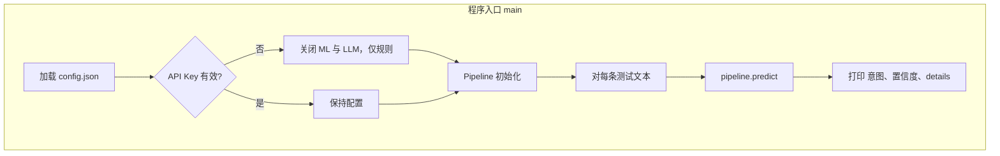
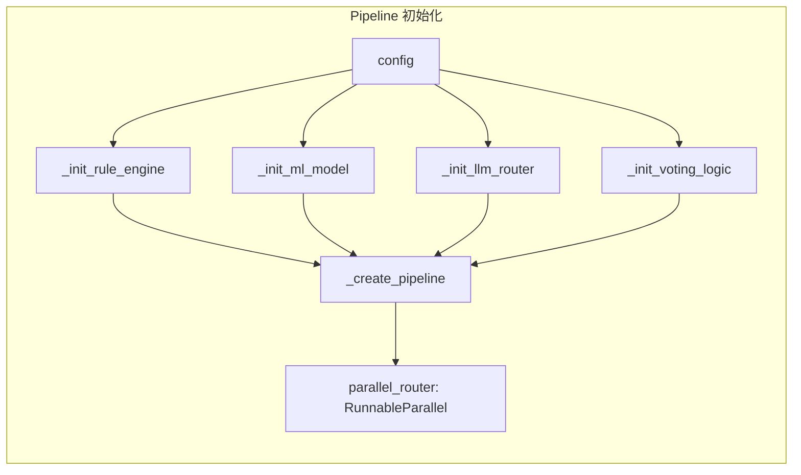
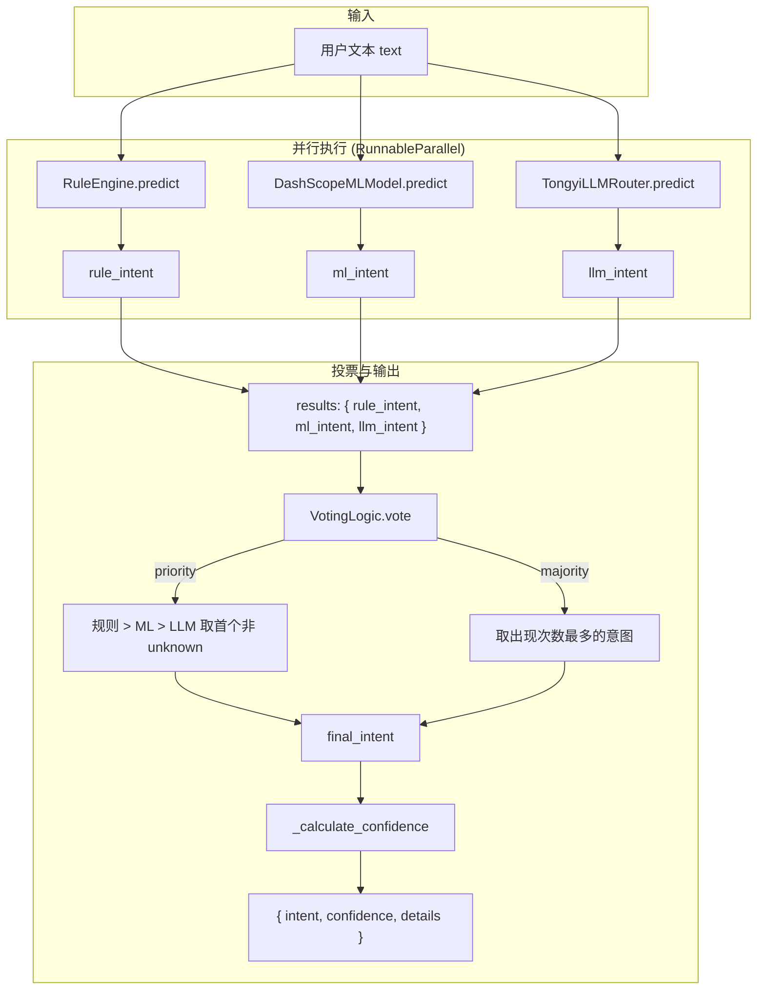
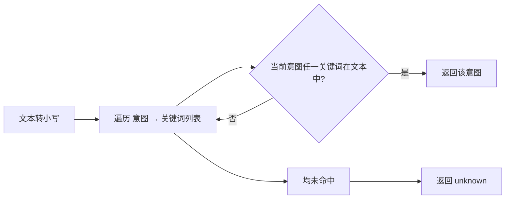
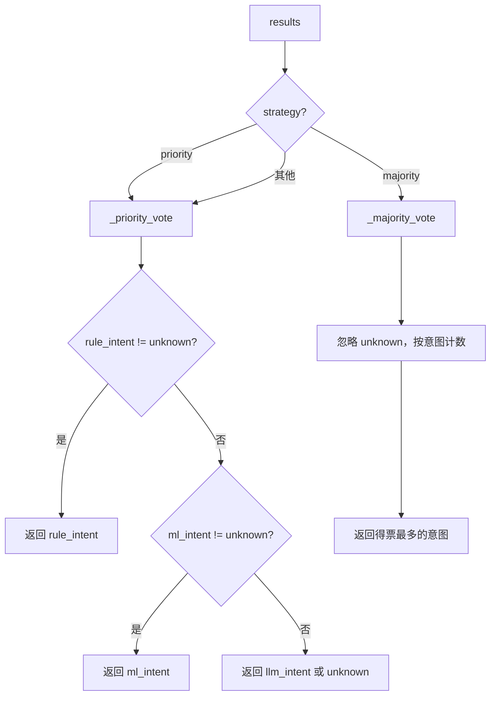

# dashscope_pipeline 逻辑说明与流程图

## 一、文件逻辑概览

本模块实现**多策略融合的意图识别**：对用户输入文本并行跑三种识别方式（规则、DashScope ML、通义 LLM），再通过投票策略得到最终意图与置信度。

| 组件 | 作用 | 输入 | 输出 |
|------|------|------|------|
| **RuleEngine** | 关键词匹配，无 API | 文本 | 意图或 `unknown` |
| **DashScopeMLModel** | HTTP 调 DashScope 文本生成做分类 | 文本 | 意图或 `unknown` |
| **TongyiLLMRouter** | dashscope SDK 调通义千问少样本分类 | 文本 + 意图列表 | 意图或 `unknown` |
| **VotingLogic** | 融合三条结果 | `{rule_intent, ml_intent, llm_intent}` | 最终意图 |
| **DashScopeIntentPipeline** | 组装上述组件，提供 `predict(text)` | 配置 + 文本 | `{intent, confidence, details}` |

- **置信度** = 与最终意图一致的方法数 / 参与的方法数（例如 3 个方法里 2 个一致则 2/3）。
- **优先级策略（priority）**：规则 > ML > LLM，取第一个非 `unknown`。
- **多数策略（majority）**：忽略 `unknown`，取出现次数最多的意图。

---

## 二、主流程（从 main 到单次 predict）

```
main()
  → load_config("config.json")
  → 若 API Key 未配置：enable_ml_model = false, enable_llm_router = false
  → DashScopeIntentPipeline(config)
       → _init_rule_engine / _init_ml_model / _init_llm_router / _init_voting_logic
       → _create_pipeline()  # 构建 RunnableParallel(rule_intent, ml_intent?, llm_intent?)
  → 对每条 test_cases 调用 pipeline.predict(text)
       → parallel_router.invoke({"input": text})  # 并行得到 results
       → voting_logic.vote(results)  # 得到 final_intent
       → _calculate_confidence(results, final_intent)
       → 返回 {intent, confidence, details}
```

---

## 三、流程图（Mermaid）

### 3.1 程序启动与单次预测总览



### 3.2 流水线初始化（DashScopeIntentPipeline.__init__）



### 3.3 单次 predict 内部：并行识别 + 投票



### 3.4 规则引擎逻辑（RuleEngine.predict）



### 3.5 投票逻辑（VotingLogic）



---

## 四、配置项说明（config.json）

| 键 | 含义 |
|----|------|
| `intents` | 意图列表，供 LLM 路由与默认配置使用 |
| `enable_rule_engine` | 是否启用规则引擎 |
| `enable_ml_model` | 是否启用 DashScope ML 模型 |
| `enable_llm_router` | 是否启用通义 LLM 路由 |
| `voting_strategy` | `"priority"` 或 `"majority"` |
| `rule_keywords` | 意图 → 关键词列表，供 RuleEngine 使用 |
| `ml_model` | `model_name`, `api_key`, `base_url` |
| `llm` | `model`, `api_key`（及可选 base_url） |

无 config 或缺少字段时，使用代码中的 `DEFAULT_INTENTS` 与 `DEFAULT_RULE_KEYWORDS`，仅规则引擎可运行。
