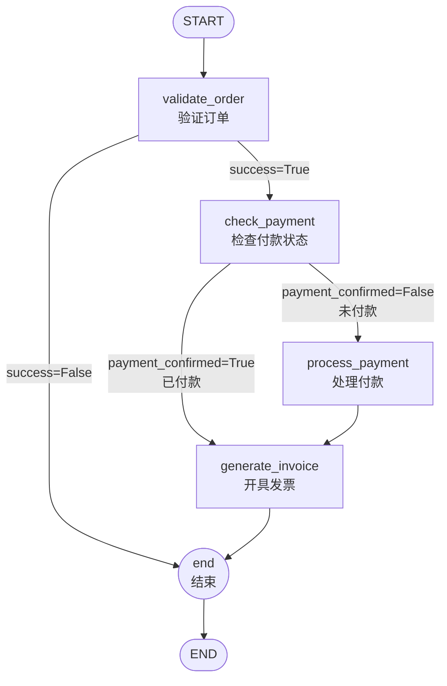

# 订单处理流程 - LangGraph 流程图

对应代码：`p35-ReACT.ipynb` 中「订单处理流程 - LangGraph 版」单元格（`build_order_graph`）。

## 总览

```
START → 验证订单 → [成功?] → 检查付款 → [已付款?] → 开具发票 → 结束 → END
                         ↓ 失败          ↓ 未付款
                         end            处理付款 → 开具发票 → 结束 → END
```

## Mermaid 流程图



## 节点说明

| 节点 | 含义 | 入参依赖 | 输出/状态变化 |
|------|------|----------|----------------|
| **validate_order** | 校验订单号是否在 Mock 数据中 | order_number | success / context.order_info / current_state=订单已验证 或 ERROR |
| **check_payment** | 看订单是否已付款 | context.order_info.payment_status | payment_confirmed=True/False，current_state=付款已处理 或 付款状态已检查 |
| **process_payment** | 模拟处理付款并写交易号 | context.order_info, payment_method | context.payment_confirmed=True，current_state=付款已处理 |
| **generate_invoice** | 生成发票号并写 context | context.order_info, invoice_type | context.invoice_*，current_state=发票已开具 |
| **end** | 若从发票节点来则写「流程已完成」并记历史；若从验证失败来则透传 | current_state, history, last_message | current_state=结束，last_message |

## 条件边说明

- **route_after_validate**：`success=True` → check_payment，`success=False` → end（订单号不存在时）。
- **route_after_check_payment**：`context.payment_confirmed=True` → generate_invoice（已付款订单跳过处理付款），`False` → process_payment。

## 两条典型路径

1. **未付款订单（如 ORD001）**  
   validate_order → check_payment → process_payment → generate_invoice → end → END。

2. **已付款订单（如 ORD003）**  
   validate_order → check_payment → generate_invoice → end → END（不经过 process_payment）。
