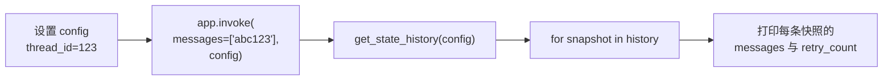
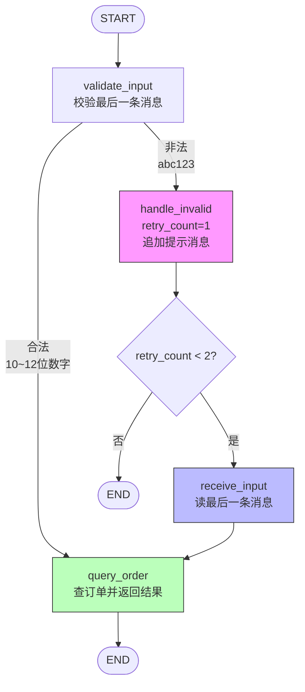
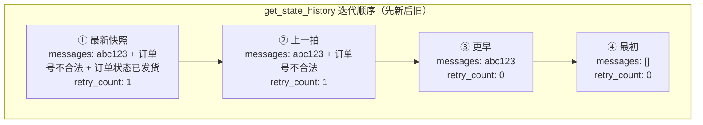
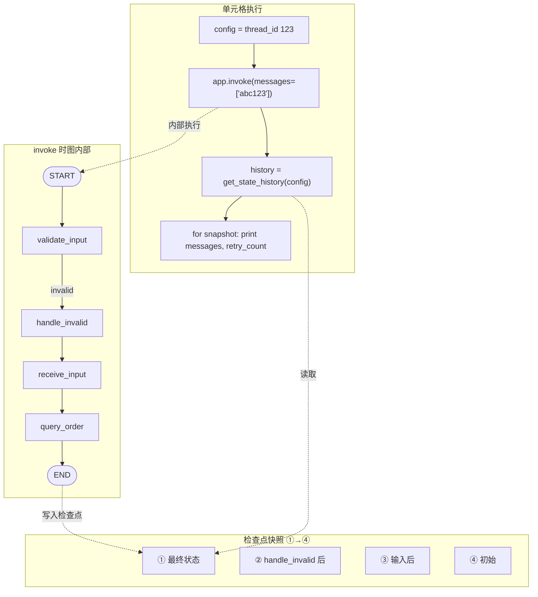

# p44-snapshot 测试运行流程图（单元格 83–97）

对应代码：

```python
config = {"configurable": {"thread_id": "123"}}
app.invoke({"messages": ["abc123"]}, config=config)
history = app.get_state_history(config)
for snapshot in history:
    print("Messages:", snapshot.values["messages"])
    print("Retry count:", snapshot.values.get("retry_count", 0))
    print("---")
```

---

## 一、单元格整体执行流程



---

## 二、`app.invoke` 内部：图执行路径（输入 `"abc123"` 非法）

输入 `"abc123"` 不是 10～12 位数字，走 **invalid → handle_invalid → receive_input → query_order → END**。



本次运行实际路径（粗线）：**START → validate_input → invalid → handle_invalid → receive_input → query_order → END**。

---

## 三、状态与快照对应关系（输入 `"abc123"`）

`get_state_history` 按**从新到旧**顺序迭代，每次 `invoke` 会留下多个检查点快照：



| 快照 | 对应时机 | messages | retry_count |
|------|----------|----------|-------------|
| ① | query_order 执行完 | [abc123, 订单号不合法..., 订单状态: 已发货] | 1 |
| ② | handle_invalid 执行完 | [abc123, 订单号不合法...] | 1 |
| ③ | 输入刚写入 / validate 前 | [abc123] | 0 |
| ④ | 图入口（尚未处理输入） | [] | 0 |

---

## 四、合在一起：单元格 + 图 + 快照



说明：先执行 `invoke`，图按上面路径跑并写入检查点；再执行 `get_state_history` 按 thread_id 读出这些快照，循环打印每条快照的 `messages` 和 `retry_count`。
